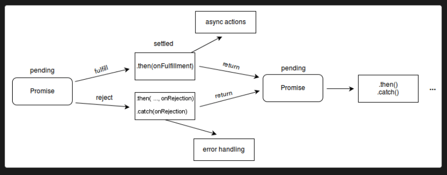

# Asynchronous JavaScript

## Why Do We Need Asynchronous Programming?

- JS is single-threaded and synchronous by default.
- If a piece of code takes 3 seconds to run, the engine won't move to the next line until those 3 seconds are up.
- That blocks the main thread — nothing else (UI updates, user input, other code) can run while it's blocked.
- We should never block the main thread for long-running work. Instead, we make that work asynchronous: it gets *initiated* immediately, but its result is only handled later, once it's ready and the call stack is empty (see [eventLoop.md](eventLoop.md) for the full mechanics of *how* "later" is scheduled).

e.g. `window.onload` fires only once all scripts/resources have finished loading — registered immediately, executed later.

> Now suppose a later line of code depends on the result of asynchronous code declared just above it. If we try to use that result immediately, we'd get `undefined` — the async code hasn't produced a value yet. We need a way to say "run this line only after the async code above has actually finished."

Think of the (comedically elaborate) analogy this file uses throughout: the process of getting approval for a marriage —
1. the girl's decision
2. the family's approval
3. a background/property check

— where each step can only start once the previous one has finished.

---

## The Problem With Plain Synchronous-Looking Code

```javascript
const getGirlDesicion = () => {
    setTimeout(() => {
        return 'Yes'
    }, 2000)
}

const girlDecision = getGirlDesicion()
console.log(girlDecision)
if (girlDecision) {
   // next steps
}
```

<details><summary>Show Answer</summary>

```
undefined
```

**Explanation:** `return`-ing from inside a `setTimeout` callback doesn't make `getGirlDesicion()` return that value — the `return 'Yes'` only returns from the anonymous callback function, 2 seconds later, to nobody in particular (`setTimeout` itself ignores whatever its callback returns). `getGirlDesicion()` itself has no explicit `return`, so it implicitly returns `undefined` immediately, and that's what `girlDecision` gets. The `if (girlDecision)` check then never even run since `undefined` is falsy. This is exactly the problem that callbacks (next) and later promises solve.

</details>

---

### A More Reusable Shape — Callback Parameters

```javascript
const getGirlDesicion1 = (cb) => {
    setTimeout(() => {
        const yourRes = 'yes'
        if (yourRes === 'yes') {
            const bioData = {
                name: 'adasf',
                property: 400000,
            }
            cb('yes', bioData)
        }
    }, 3000)
}

const getFamiliesPermission1 = (girlResp, bioData, cb) => {
    setTimeout(() => {
        const familyRes = 'yes'
        if (girlResp === 'yes' && familyRes === 'yes') {
            cb('yes', { ...bioData, initialApproval: 'yes' })
        }
    }, 2000)
}

const analyzePropertyAndBackground = (bioData, cb) => {
    setTimeout(() => {
        const { property } = bioData
        if (property <= 100000) {
            cb({ ...bioData, finalRemarks: "Property: kuch na hai iske pass!" })
        } else if (property <= 500000) {
            cb({ ...bioData, finalRemarks: "Property: Isse acha mil jaayega" })
        } else {
            cb({ ...bioData, finalRemarks: "Property thodi dekha jaata. Aap bharat laao." })
        }
    }, 3000)
}

const getMarriageApproval1 = () => {
    getGirlDesicion1((ladkiKaResponse, bioData) => {
        console.log("Got response from girl:", ladkiKaResponse, bioData)

        getFamiliesPermission1(ladkiKaResponse, bioData, (overallRes, updatedBioData) => {
            console.log("Family and girl response now: ", overallRes, updatedBioData)

            analyzePropertyAndBackground(bioData, (finalizedBioData) => {
                console.log(finalizedBioData.finalRemarks)
            })
        })
    })
}
getMarriageApproval1()
```

<details><summary>Show Answer</summary>

Same output shape as above, just restructured so each function takes a callback parameter instead of hardcoding the next step inline — a slightly more reusable version of the same nested pattern.

**Issue with both solutions above:** they only handle the "happy path." Real code also needs to handle failure at every step — and that makes the nesting even worse, as the next example shows.

</details>

### Adding Error Handling Makes It Worse

```javascript
const getGirlDesicionWithResAndErr = (acceptCb, rejectCb) => {
    setTimeout(() => {
        const yourRes = 'yes'
        if (yourRes === 'yes') {
            const bioData = {
                name: 'adasf',
                property: 400000,
            }
            acceptCb('yes', bioData)
        } else {
            const reason = {
                actualReason: 'Pasand na hai. Jldi bhaag',
                excuse: 'Caste same nhi, Career dekhna hai, chota hai'
            }
            rejectCb(reason)
        }
    }, 3000)
}

getGirlDesicionWithResAndErr((res, bioData) => {
    console.log("Tumhara response: ", res)
    console.log("Forwarded biodata: ", bioData)
}, (reason) => {
    console.log(reason.excuse)
})
```

<details><summary>Show Answer</summary>

```
Tumhara response:  yes
Forwarded biodata:  { name: 'adasf', property: 400000 }
```

**Explanation:** just handling *one* step's success/failure already needs two separate callback parameters. Multiply that by every step in a real multi-step chain, and the nesting becomes genuinely unmanageable.

</details>

### Conclusion: Callback Hell

- Nesting multiple inter-dependent callbacks inside each other is called **callback hell**.
- The resulting code shape resembles a pyramid — hence the other common name, **"pyramid of doom."**
- It makes code difficult to read, reason about, and maintain.

**Problems with callback hell:**
1. Non-readable, deeply indented structure.
2. Increased risk of variable shadowing between nested scopes.
3. A separate error-handling callback needs to be threaded through every single level.

---

## Promises

### Analogy

- Imagine you've *promised* to give a final answer by June 12th.
- Until then, the outcome is **pending** — it hasn't happened yet: `{ state: 'pending', result: undefined }`.
- On June 12th, one of two things happens:
  1. **Fulfilled** — you keep your promise and give your answer. `{ state: 'fulfilled', result: yourAnswer }`.
  2. **Rejected** — you give a reason for not keeping it. `{ state: 'rejected', reason: yourExcuse }`.
- Either way, the promise **settles** — it moves from pending to one final, unchangeable state.

Formally:
- A `Promise` is an object representing the eventual result of an asynchronous operation — either a resolved value or a reason for failure.
- It lets asynchronous functions *return something* immediately (a promise object), instead of returning nothing and requiring a callback — the actual value arrives later, once the promise settles.
- A `Promise` is always in exactly one of three states:
  - **pending** — initial state, neither fulfilled nor rejected yet.
  - **fulfilled** — the operation completed successfully. (settled)
  - **rejected** — the operation failed. (also settled)

### Reacting to a Settled Promise

Once a promise settles, there are three ways to react:
1. `.then()` — runs if the promise was fulfilled.
2. `.catch()` — runs if the promise was rejected.
3. `.finally()` — runs either way, once the promise has settled, regardless of outcome.

**Daily use case:** an API call that opens a modal, does something on success, shows a notification on error, and always closes the modal at the end — that's exactly `.then()` / `.catch()` / `.finally()`.



### Important Points

- `resolve()`/`reject()` accept a **single** argument. Passing extra arguments doesn't throw — they're just silently dropped.

```javascript
new Promise((resolve) => resolve(5, 6)).then(v => console.log(v));    // 5 — the 6 is silently dropped
new Promise((resolve) => resolve([5, 6])).then(v => console.log(v));  // [ 5, 6 ] — wrap multiple values in an array/object instead
```

- Each `.then()`, `.catch()`, and `.finally()` returns a **new** promise, which is why they can be chained.
- You *can* chain multiple `.finally()` blocks onto the same promise — each runs, in the order they're attached.
- `.finally()`'s callback receives **no value** (even if the previous step resolved with one), and whatever it returns is **ignored** by the next `.then()` in the chain — the value from the last `.then()` before it passes straight through.

**Best practices:**
1. Prefer a single `.finally()` block, and don't return anything meaningful from it — same spirit as a `try/finally` block.
2. `.finally()` callbacks always run, regardless of whether the promise fulfilled or rejected.
3. Use `.finally()` for cleanup (closing a modal, hiding a spinner, releasing a resource) — not business logic.

```javascript
const girlResponse = new Promise((resolve, reject) => {
    setTimeout(() => {
        const yourResponse = 'yes'
        if (yourResponse === 'yes') {
            resolve('Hamari taraf se haan hai.')
        } else {
            reject('Chale jaa meri najron se door')
        }
    }, 3000)
})
```
---

## Escaping Callback Hell With Promises

Revisiting the marriage-approval example from the top of this file — now handling both acceptance *and* rejection at every step, without nesting:

```javascript
const getGirlDesicion2 = () => {
    return new Promise((resolve, reject) => {
        setTimeout(() => {
            const yourRes = 'yes'
            if (yourRes === 'yes') {
                const bioData = {
                    name: 'adasf',
                    property: 400000,
                }
                resolve(bioData)
            } else {
                reject('Aur kitni baar mana karu.')
            }
        }, 3000)
    })
}

const getFamiliesPermission2 = (girlResp, bioData) => {
    return new Promise((resolve, reject) => {
        setTimeout(() => {
            const familyRes = 'yes'
            if (girlResp === 'yes' && familyRes === 'yes') {
                resolve({ ...bioData, initialApproval: 'yes' })
            } else {
                reject('Papa nhi maan rhe..')
            }
        }, 2000)
    })
}

const analyzePropertyAndBackground2 = (bioData) => {
    return new Promise((resolve, reject) => {
        setTimeout(() => {
            const { property } = bioData
            if (property <= 100000) {
                reject({ ...bioData, finalRemarks: "Property: kuch na hai iske pass!" })
            } else if (property <= 500000) {
                resolve({ ...bioData, finalRemarks: "Property: Isse acha mil jaayega" })
            } else {
                resolve({ ...bioData, finalRemarks: "Property thodi dekha jaata. Aap bharat laao." })
            }
        }, 5000)
    })
}

const getMarriageApproval2 = () => {
    getGirlDesicion2()
        .then(bioData => {
            console.log("Got response from girl: yes ", bioData)
            return getFamiliesPermission2('yes', bioData)
        })
        .then(updatedBioData => {
            console.log("Family and girl response now: yes")
            return analyzePropertyAndBackground2(updatedBioData)
        })
        .then(finalizedBioData => {
            console.log("Final remark: ", finalizedBioData.finalRemarks)
            console.log("Sab maan gye")
        })
        .catch(issue => {
            console.log('Rejection reason: ', issue)
        })
        .finally(() => {
            console.log("Finally decision ho gya.")
        })
}
getMarriageApproval2()
```

<details><summary>Show Answer (happy path — every step resolves)</summary>

```
Got response from girl: yes  { name: 'adasf', property: 400000 }
Family and girl response now: yes
Final remark:  Property thodi dekha jaata. Aap bharat laao.
Sab maan gye
Finally decision ho gya.
```

**Explanation:** each function now returns a `Promise` instead of taking a callback, so the chain reads top-to-bottom like a sequence of steps — no nesting, and a single `.catch()` at the end handles rejection from *any* step in the chain, replacing the "separate error callback per level" problem from the callback-based version. This is the direct fix for every problem listed in the Callback Hell conclusion above.

</details>

After learning `async`/`await`, try simplifying this same example using that instead — see [AsyncAwait.md](AsyncAwait.md).

--- 

## Rules of Promise Chaining: How Values and Errors Actually Flow

Every `.then()`, `.catch()`, and `.finally()` call returns a **brand-new promise** — that's the whole reason chaining works. What determines whether that new promise is fulfilled or rejected, and with what value, follows a small set of consistent rules. Get comfortable with these and every "predict the output" chaining question becomes mechanical instead of guesswork.

**Rule 1 — A returned value becomes the next `.then()`'s input.**
Whatever a `.then()` (or `.catch()`) callback `return`s becomes the resolved value that the *next* `.then()` in the chain receives as its parameter.

**Rule 2 — Returning nothing means the next `.then()` receives `undefined`.**
If a `.then()` callback doesn't explicitly `return` anything, its "return value" is `undefined` — same as any JS function — and that's exactly what flows to the next step.

**Rule 3 — Returning a promise gets automatically unwrapped/awaited.**
If a `.then()`/`.catch()` callback returns *another promise* (or any thenable) instead of a plain value, the chain automatically waits for that inner promise to settle, and unwraps it — the next `.then()` receives the inner promise's resolved value directly, never a nested `Promise` object.

**Rule 4 — A `.then()` with no error handler passes a rejection straight through, unchanged.**
`.then(onFulfilled)` only reacts to fulfillment. If the promise it's attached to is rejected, that `.then()` call is skipped entirely (its `onFulfilled` never runs), and the *same* rejection reason is forwarded untouched to the next handler downstream that actually has an error handler (a `.catch()`, or a `.then(_, onRejected)`).

**Rule 5 — `.catch(fn)` is exactly `.then(undefined, fn)`.**
There's no special magic to `.catch()` — it's shorthand for a `.then()` call with only the rejection handler filled in. Anywhere you see `.catch(fn)`, you can mentally substitute `.then(undefined, fn)`, and vice versa.

**Rule 6 — If a `.catch()` (or `.then()`'s `onRejected`) returns normally, it "heals" the chain back to fulfilled.**
Catching an error and returning a plain value (not re-throwing) turns the chain back into a *fulfilled* state from that point on — the very next `.then()` runs its `onFulfilled` handler, receiving whatever the catch handler returned. This is one of the most commonly missed rules: **a `.catch()` doesn't keep the chain "in error mode" forever** — it resets it, exactly like a `try/catch` block resuming normal execution after the `catch`.

**Rule 7 — If a handler throws (or returns a rejected promise), the chain becomes/stays rejected.**
This applies inside *any* handler — `.then()`'s `onFulfilled`, `.catch()`'s handler, even `.finally()`. Throwing (or returning a promise that itself rejects) makes the *next* promise in the chain reject with that new reason, skipping over any `.then()`s until the next handler with an error path.

**Rule 8 — Sibling handlers in the same `.then(onFulfilled, onRejected)` call don't catch each other's errors.**
If `onFulfilled` throws, the `onRejected` passed in that *same* `.then()` call does **not** catch it — `onRejected` only ever reacts to the promise the `.then()` was originally attached to, not to errors from its own sibling callback. An error thrown inside `onFulfilled` only gets caught by a `.catch()`/`onRejected` *further down* the chain.

**Rule 9 — `.finally()` callbacks receive no value and can't see whether the chain fulfilled or rejected.**
Unlike `.then()`/`.catch()`, a `.finally()` callback is called with zero arguments — there's no way to inspect the settled value/reason from inside it (by design — it's meant purely for cleanup that runs regardless of outcome).

**Rule 10 — `.finally()` normally passes the original value/rejection through untouched...**
Whatever `.finally()`'s callback `return`s is normally **ignored** — the next step in the chain still receives the *original* fulfilled value or rejection reason from before the `.finally()`, as if the `.finally()` weren't there at all.

**Rule 11 — ...unless `.finally()` itself throws, or returns a rejected promise — then it overrides the outcome.**
If the `.finally()` callback throws an error, or returns a promise that rejects, that *new* rejection replaces whatever the chain's original outcome was (even if it had previously fulfilled successfully) — the next handler downstream sees the `.finally()`'s error instead of the original value.

**Rule 12 — Multiple `.finally()`s can be chained, and each runs in attachment order.**
Since `.finally()` returns a new promise carrying the same settled value/reason forward (Rule 10), you can chain several in a row — each one fires in the order it was attached, and (per Rule 10) the original value/reason still survives all of them, as long as none of them throw.

### Rule Drills — One Short Chain per Rule

A quick round of minimal, single-rule examples before the longer scenario-based questions below. Each is annotated with exactly which rule(s) it's testing.

**Drill 1 — Rule 1: value chains through multiple `.then()`s**

```javascript
Promise.resolve(5)
    .then((x) => x + 5)
    .then((x) => x * 2)
    .then(console.log);
```

<details><summary>Show Answer</summary>

```
20
```

`5 → +5 → 10 → *2 → 20`. Each `.then()`'s return value becomes the next one's input, one hop at a time.

</details>

**Drill 2 — Rule 2: no `return` means the next `.then()` gets `undefined`**

```javascript
Promise.resolve(5)
    .then((x) => {
        console.log(x);
    })
    .then(console.log);
```

<details><summary>Show Answer</summary>

```
5
undefined
```

The first `.then()` logs `5` but doesn't `return` anything — so its resolved value is `undefined`, which is exactly what the second `.then()` (`console.log`) receives and prints.

</details>

**Drill 3 — Rule 2: an explicit bare `return;` is the same as not returning at all**

```javascript
Promise.resolve(5)
    .then((x) => {
        return;
    })
    .then(console.log);
```

<details><summary>Show Answer</summary>

```
undefined
```

`return;` with nothing after it returns `undefined`, identical in effect to Drill 2's implicit no-return.

</details>

**Drill 4 — Rule 3: returning a promise gets unwrapped automatically**

```javascript
Promise.resolve(5)
    .then((x) => {
        return Promise.resolve(x * 10);
    })
    .then(console.log);
```

<details><summary>Show Answer</summary>

```
50
```

The `.then()` returns a *promise* (`Promise.resolve(50)`), not a plain value — the chain automatically waits for it and unwraps it, so the next `.then()` receives `50` directly, not a nested `Promise` object.

</details>

**Drill 5 — Rules 4 & 7: throwing skips the next `.then()`, caught by `.catch()`**

```javascript
Promise.resolve(5)
    .then((x) => {
        throw "Error";
    })
    .then(console.log)
    .catch(console.log);
```

<details><summary>Show Answer</summary>

```
Error
```

Throwing inside the first `.then()` rejects the chain (Rule 7) — the following bare `.then(console.log)` has no rejection handler, so it's skipped entirely (Rule 4), and the error falls through to `.catch()`.

</details>

**Drill 6 — Rule 6: `.catch()` returning a value heals the chain**

```javascript
Promise.resolve(5)
    .then((x) => {
        throw "Error";
    })
    .catch((err) => {
        console.log(err);
        return 100;
    })
    .then(console.log);
```

<details><summary>Show Answer</summary>

```
Error
100
```

`.catch()` logs the error and returns `100` — a normal return, not a re-throw — so per Rule 6 the chain heals back to fulfilled, and the trailing `.then()` runs normally with `100`.

</details>

**Drill 7 — Rules 2 & 6: `.catch()` with no return still heals, just with `undefined`**

```javascript
Promise.resolve(5)
    .then((x) => {
        throw "Error";
    })
    .catch((err) => {
        console.log(err);
    })
    .then(console.log);
```

<details><summary>Show Answer</summary>

```
Error
undefined
```

Same healing as Drill 6 (Rule 6), but since this `.catch()` doesn't explicitly return anything, it heals the chain with `undefined` (Rule 2) instead of a real value — a combination that's easy to mix up with Drill 5's "stays rejected" case if you're not tracking whether the catch handler returns or re-throws.

</details>

**Drill 8 — Rules 3 & 7: returning a *rejected* promise from `.then()`**

```javascript
Promise.resolve(5)
    .then((x) => {
        return Promise.reject("Failed");
    })
    .then(console.log)
    .catch(console.log);
```

<details><summary>Show Answer</summary>

```
Failed
```

The first `.then()` returns a promise (Rule 3 — gets unwrapped/awaited), but that inner promise is itself rejected — so per Rule 7, the outer chain becomes rejected too. The next bare `.then()` is skipped (Rule 4), and `.catch()` receives `"Failed"`.

</details>

**Drill 9 — Rules 1, 6 & 7 combined: recover mid-chain, then keep chaining normally**

```javascript
Promise.resolve(5)
    .then((x) => x * 2)
    .then((x) => {
        throw "Boom";
    })
    .catch((err) => {
        return 100;
    })
    .then((x) => x + 1)
    .then(console.log);
```

<details><summary>Show Answer</summary>

```
101
```

`5 * 2 = 10`, then a throw rejects the chain (Rule 7), `.catch()` recovers it back to fulfilled with `100` (Rule 6), and everything after that behaves like a perfectly normal fulfilled chain again — `100 + 1 = 101` flows through the final `.then()` (Rule 1), completely unaware anything ever went wrong upstream.

</details>

**Drill 10 — Rules 6 & 7: a `.catch()` that re-throws, followed by a `.catch()` that heals**

```javascript
Promise.reject("A")
    .catch((err) => {
        throw "B";
    })
    .catch((err) => {
        return "C";
    })
    .then(console.log);
```

<details><summary>Show Answer</summary>

```
C
```

The first `.catch()` receives `"A"` but re-throws `"B"` — per Rule 7, that keeps the chain rejected, just with a new reason. The *second* `.catch()` receives `"B"` (not `"A"` — each `.catch()` only ever sees the nearest upstream rejection) and this time returns normally with `"C"`, healing the chain (Rule 6). The final `.then()` sees the healed value, `"C"`.

</details>

**Drill 11 — Rule 10: `.finally()` doesn't alter a fulfilled value, even if it returns something**

```javascript
Promise.resolve(10)
    .finally(() => {
        return 999;
    })
    .then(console.log);
```

<details><summary>Show Answer</summary>

```
10
```

`.finally()`'s return value (`999`) is discarded — the original fulfilled value (`10`) passes straight through untouched, exactly as Rule 10 describes.

</details>

**Drill 12 — Rules 9 & 10: `.finally()` on a rejected chain, still can't see or alter the reason**

```javascript
Promise.reject("Error")
    .finally(() => {
        console.log("Cleanup");
    })
    .catch(console.log);
```

<details><summary>Show Answer</summary>

```
Cleanup
Error
```

`.finally()` runs (logging `"Cleanup"`) but receives no argument — it can't see `"Error"` at all (Rule 9). It also doesn't swallow or alter the rejection — `"Error"` passes through unchanged to the `.catch()` (Rule 10).

</details>

**Drill 13 — Rules 1, 2 & 3 combined: a longer chain, recovered with nullish coalescing**

```javascript
Promise.resolve(1)
    .then((x) => {
        return x + 1;
    })
    .then((x) => {
        return Promise.resolve(x + 1);
    })
    .then((x) => {
        return;
    })
    .then((x) => {
        return x ?? 100;
    })
    .then(console.log);
```

<details><summary>Show Answer</summary>

```
100
```

Step by step: `1` → (`+1`, Rule 1) → `2` → (returns a promise resolving `3`, Rule 3, unwrapped) → `3` → (bare `return;`, Rule 2) → `undefined` → (`x ?? 100`, and `undefined ?? 100` is `100`) → `100`. This is a good example of how plain JS operators (`??`) can be layered on top of the chaining rules — the promise mechanics don't disappear just because there's other logic mixed in.

</details>

**Drill 14 — Full walkthrough: value flow, a thrown error, recovery, then cleanup**

```javascript
Promise.resolve(10)
    .then((x) => {
        console.log(x);
        return x + 10;
    })
    .then((x) => {
        console.log(x);
        throw "Oops";
    })
    .catch((e) => {
        console.log(e);
        return 50;
    })
    .then((x) => {
        console.log(x);
    })
    .finally(() => {
        console.log("Done");
    });
```

<details><summary>Show Answer</summary>

```
10
20
Oops
50
Done
```

Tracing it against the rules: `10` logs, returns `20` (Rule 1) → `20` logs, then throws `"Oops"` (Rule 7, rejects the chain) → `.catch()` logs `"Oops"` and returns `50`, healing the chain (Rule 6) → the next `.then()` logs `50` (Rule 1, chain is fulfilled again) and returns nothing (implicitly `undefined`, Rule 2) → `.finally()` runs last regardless, logging `"Done"`, without seeing or altering that `undefined` (Rules 9 & 10). Every line here maps directly onto one of the twelve rules above.

</details>

---

### Question 1 — Basic `.then()`/`.catch()`/`.finally()`

```javascript
console.log('Log: girlResponse ->', girlResponse)
girlResponse
    .then(res => {
        console.log('Log: Response ->', res)
    })
    .catch(err => {
        console.log('Error: ', err)
    })
    .finally(() => {
        console.log("Log: Finally i made my decision.")
    })
```

<details><summary>Show Answer</summary>

```
Log: girlResponse -> Promise { <pending> }
Log: Response -> Hamari taraf se haan hai.
Log: Finally i made my decision.
```

**Explanation:** logging the promise object itself immediately shows `<pending>`, since the `setTimeout` inside it hasn't resolved yet — logging a promise only ever shows a snapshot of its state *at that moment*. Once it resolves (after 3s here), the `.then()` callback fires with the resolved value, `.catch()` is skipped since nothing was rejected, and `.finally()` runs regardless.

</details>

### Question 2 — Chaining *Without* Returning From `.then()`

```javascript
girlResponse
    .then(res => {
        console.log('Log: Response ->', res)
    })
    .then(res => {
        console.log('Log: ', res) // what's res here?
        console.log("Log: Shaadi karega na")
    })
    .catch(err => {
        console.log('Error: ', err)
    })
    .finally(() => {
        console.log("Log: Finally i made my decision.")
    })
```

<details><summary>Show Answer</summary>

```
Log: Response -> Hamari taraf se haan hai.
Log:  undefined
Log: Shaadi karega na
Log: Finally i made my decision.
```

**Explanation:** the first `.then()` doesn't `return` anything, so it implicitly resolves with `undefined` — and that `undefined` is exactly what the *next* `.then()` receives as `res`. Each `.then()`'s return value (or lack of one) becomes the resolved value that the next `.then()` in the chain receives.

</details>

### Question 3 — Chaining *With* Returning From `.then()`

```javascript
girlResponse
    .then(res => res)
    .then(res => {
        console.log('Log: ', res)
        return `Log: Shaddi karega na?`
    })
    .then(res => {
        console.log('Log: ', res)
        return `Log: Dahej tu dega lekin, theek na.`
    })
    .then(res => {
        console.log('Log :', res)
        return `Log: Mein ghar ka koi kaam nhi karungi. Soch le`
    })
    .catch(err => {
        console.log('Error: ', err)
    })
    .finally(() => {
        console.log("Log: Finally i made my decision.")
    })
```

<details><summary>Show Answer</summary>

```
Log:  Hamari taraf se haan hai.
Log:  Log: Shaddi karega na?
Log : Log: Dahej tu dega lekin, theek na.
Log: Finally i made my decision.
```

**Explanation:** now each `.then()` explicitly returns a value, and that becomes the next `.then()`'s `res` — a proper chain of transformations, each step building on the previous result. (Note: only three log lines appear from the four `.then()`s, since the very last `.then()`'s `return` value has nothing downstream to log it.)

</details>

### Question 4 — Returning a *Promise* From `.then()`

```javascript
girlResponse
    .then(res => res)
    .then(res => {
        console.log('Log: ', res)
        return new Promise((resolve) => {
            setTimeout(() => {
                resolve('Shaddi karega na?')
            }, 200)
        })
    })
    .then(res => {
        console.log('Log: ', res)
        return new Promise((resolve) => {
            setTimeout(() => {
                resolve(`Dahej tu dega lekin, theek na.`)
            }, 200)
        })
    })
    .then(res => {
        console.log('Log: ', res)
        return new Promise((resolve) => {
            setTimeout(() => {
                resolve(`Mein ghar ka koi kaam nhi karungi. Soch le`)
            }, 200)
        })
    })
    .catch(err => {
        console.log('Error: ', err)
    })
    .finally(() => {
        console.log("Log: Finally i made my decision.")
    })
```

<details><summary>Show Answer</summary>

```
Log:  Hamari taraf se haan hai.
Log:  Shaddi karega na?
Log:  Dahej tu dega lekin, theek na.
Log: Finally i made my decision.
```

**Explanation:** when a `.then()` callback returns *another promise* (instead of a plain value), the chain automatically waits for that inner promise to settle before moving on — it's automatically "unwrapped." The next `.then()` receives the inner promise's resolved value directly, not a nested `Promise` object. This is what lets you chain dependent async steps cleanly, each waiting for the previous one's actual async work to complete.

</details>

### Question 5 — Rejecting Partway Through a Chain

```javascript
girlResponse
    .then(res => {
        console.log('Log: ', res)
        return new Promise((resolve) => setTimeout(() => resolve('step2'), 200))
    })
    .then(res => {
        console.log('Log: ', res)
        return new Promise((resolve, reject) => setTimeout(() => reject('rejected at step 3'), 200))
    })
    .then(res => {
        console.log('this should be skipped:', res)
        return 'unreached'
    })
    .catch(err => console.log('Error caught at nearest catch: ', err))
    .finally(() => console.log("Finally still runs"))
```

<details><summary>Show Answer</summary>

```
Log:  Hamari taraf se haan hai.
Log:  step2
Error caught at nearest catch:  rejected at step 3
Finally still runs
```

**Explanation:** as soon as one step in the chain rejects, every `.then()` after it is **skipped entirely** — control jumps straight to the nearest `.catch()` downstream. `.finally()` still runs regardless of whether the chain fulfilled or rejected.

</details>

### Question 6 — A `.catch()` That Returns Normally "Heals" the Chain (Rule 6)

```javascript
Promise.reject('boom')
    .catch(err => {
        console.log('caught:', err);
        return 'recovered value';
    })
    .then(v => console.log('next then:', v));
```

<details><summary>Show Answer</summary>

```
caught: boom
next then: recovered value
```

**Explanation:** the `.catch()` handles the rejection and returns a plain value (`'recovered value'`) instead of re-throwing — per Rule 6, that turns the chain back into a *fulfilled* state from that point forward. The next `.then()` isn't skipped; it runs normally and receives `'recovered value'` as `v`, exactly as if the original promise had fulfilled with that value all along.

</details>

### Question 7 — Re-Throwing Inside `.catch()` Keeps the Chain Rejected (Rules 6 & 7)

```javascript
Promise.reject('boom2')
    .catch(err => {
        console.log('caught2:', err);
        throw new Error('re-thrown');
    })
    .then(v => console.log('SHOULD NOT RUN:', v))
    .catch(err => console.log('second catch:', err.message));
```

<details><summary>Show Answer</summary>

```
caught2: boom2
second catch: re-thrown
```

**Explanation:** this time the `.catch()` handler doesn't recover — it re-throws a *new* error. Per Rule 7, that keeps (or in this case, re-establishes) the chain in a rejected state, so the following `.then()` is skipped entirely (Rule 4), and control falls through to the *next* `.catch()` downstream, which receives the new `'re-thrown'` error — not the original `'boom2'`.

</details>

### Question 8 — A Rejection Skips Over a Bare `.then()` (Rule 4)

```javascript
Promise.reject('boom3')
    .then(v => console.log('SHOULD NOT RUN'))
    .catch(err => console.log('skips over bare then:', err));
```

<details><summary>Show Answer</summary>

```
skips over bare then: boom3
```

**Explanation:** the `.then()` here only supplies an `onFulfilled` handler — no second argument for rejections. Since the promise is rejected, this `.then()` is a no-op for it (Rule 4); the original rejection reason (`'boom3'`) passes straight through, completely unmodified, to the first `.catch()` that actually has a handler for it.

</details>

### Question 9 — Recovering via `.then()`'s Second Argument Instead of `.catch()` (Rules 5 & 6)

```javascript
Promise.reject('err1')
    .then(
        v => console.log('SHOULD NOT RUN'),
        err => { console.log('handled in then 2nd arg:', err); return 'healed'; }
    )
    .then(v => console.log('next then:', v));
```

<details><summary>Show Answer</summary>

```
handled in then 2nd arg: err1
next then: healed
```

**Explanation:** `.then(onFulfilled, onRejected)`'s second argument reacts to rejection exactly like a `.catch()` would (Rule 5 — they're equivalent). And just like Question 6, returning normally from that rejection handler heals the chain back to fulfilled (Rule 6), so the next `.then()` runs normally with the returned value.

</details>

### Question 10 — Sibling Handlers Don't Catch Each Other's Errors (Rule 8)

```javascript
Promise.resolve('ok')
    .then(
        v => { throw new Error('thrown in onFulfilled'); },
        err => console.log('SHOULD NOT catch sibling error')
    )
    .catch(err => console.log('falls through to next catch:', err.message));
```

<details><summary>Show Answer</summary>

```
falls through to next catch: thrown in onFulfilled
```

**Explanation:** this is a frequently-missed gotcha. The `onRejected` handler passed alongside `onFulfilled` in the *same* `.then()` call only reacts to the promise that `.then()` was originally attached to — it does **not** catch errors thrown by its own sibling `onFulfilled` in that same call (Rule 8). Since `Promise.resolve('ok')` fulfilled (no rejection for `onRejected` to react to), but `onFulfilled` itself threw, that error can only be caught by a `.catch()`/`onRejected` *further down* the chain — here, the trailing `.catch()`.

</details>

### Question 11 — `.finally()` Overriding the Chain by Throwing (Rules 9, 10 & 11)

```javascript
Promise.resolve('original value')
    .finally(() => {
        throw new Error('finally threw');
    })
    .then(v => console.log('SHOULD NOT RUN'))
    .catch(err => console.log('finally overrides original fulfillment:', err.message));
```

<details><summary>Show Answer</summary>

```
finally overrides original fulfillment: finally threw
```

**Explanation:** normally, `.finally()` is transparent — whatever it returns is ignored, and the *original* value/rejection passes through untouched (Rule 10), which is why the earlier `.finally()` examples in Question 5 never affected the values flowing past them. But this is the exception: since this `.finally()` callback *throws*, that new error **overrides** the chain's original outcome entirely (Rule 11) — even though the chain had successfully fulfilled with `'original value'` right before the `.finally()` ran. The following `.then()` is skipped, and the new error lands in the next `.catch()` instead.

</details>

---

## Practical Example: Chained Real-World `fetch` Calls

```javascript
fetch('/article/promise-chaining/user.json')
  .then(response => response.json())
  .then(user => fetch(`https://api.github.com/users/${user.name}`))
  .then(response => response.json())
  .then(githubUser => new Promise((resolve, reject) => {
    // simulate showing an avatar animation for 3 seconds before continuing
    setTimeout(() => {
      resolve(githubUser);
    }, 3000);
  }))
  .then(githubUser => alert(`Finished showing ${githubUser.name}`));
```

Each step depends on the previous one's result: fetch a local user file, use that user's name to fetch their GitHub profile, wait a bit (simulating some UI animation), then show the final result — all without a single level of nested indentation, thanks to returning a promise (or a plain value) from each `.then()`.

---

## Quiz on Promises

For more interactive quiz questions: [Promises I/O Quiz](https://danlevy.net/javascript-promises-quiz/)

### Question 12 — `.finally()` and Value Passthrough (Rules 9 & 10)

```javascript
const promise = new Promise((res) => res(2));

promise
.then((v) => {
    console.log(v);
    return v * 2;
})
.finally(() => {
    console.log('finally 1');
    return 'finally 1';
})
.then((v) => {
    console.log(v);
    return v * 2;
})
.finally((v) => {
    console.log('finally 2', v);
    return 'finally 2';
})
.then((v) => {
    console.log(v);
});
```

<details><summary>Show Answer</summary>

```
2
finally 1
4
finally 2 undefined
8
```

**Explanation:**
- `finally()` callbacks never receive the chain's value — that's why `v` logs as `undefined` in the second `.finally()`.
- Whatever a `.finally()` callback returns is discarded — the value flowing through the chain always comes from the nearest preceding `.then()`, unaffected by any `.finally()` in between.
- So the chain of values is: `2` → (`*2`) → `4` → (`*2`) → `8`, with the two `.finally()` calls just logging along the way without altering that flow.

</details>

### Question 13 — Chained `.finally()`s on a *Rejected* Chain (Rules 10 & 12)

```javascript
Promise.reject('original error')
    .finally(() => console.log('finally A'))
    .finally(() => console.log('finally B'))
    .catch(err => console.log('caught after both finally:', err));
```

<details><summary>Show Answer</summary>

```
finally A
finally B
caught after both finally: original error
```

**Explanation:** Question 12 showed chained `.finally()`s passing a *fulfilled* value through untouched — this confirms the same holds for a *rejected* chain. Both `.finally()` blocks run, in attachment order, purely for their side effects (Rule 12) — neither one alters or swallows the rejection, so `'original error'` reaches the final `.catch()` completely unchanged, exactly as if neither `.finally()` were there at all (Rule 10).

</details>

---

