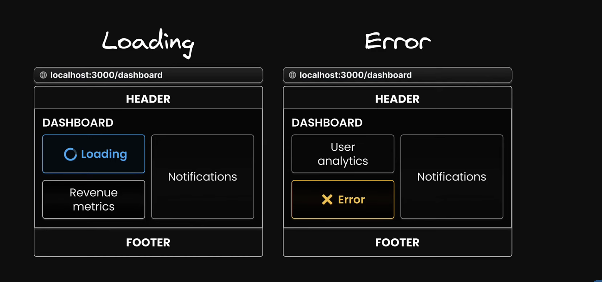

#### What is NextJs?
- Next.JS is a React framework for building web applications.
- When used React alone, it's not feasible to create a fully-featured application ready for production. React is only responsible for the view part of application. We need to manually consider for routing, data fetching and more.
- It uses React for building user interfaces.
- Provides additional features that enables us to build production ready applications.
- These features include routing, optimized rendering, data fetching, bundling, compiling and more.
- we don't need any additional library for this, howsoever some conventions need to be followed to implement these features.

#### Features of NextJS
- Routing
- API Routes
- Rendering (server/client)
- Data fetching
- Styling (css modules, tailwind, sass)
- Optimization (font, images and scripts)
- Dev and prod build system

#### Component Hierarchy

- layout.tsx
- template.tsx
- error.tsx
- loading.tsx
- not-found.tsx
- page.tsx

```
    <Layout>
        <Template>
            <ErrorBoundary fallback={<Error />}>
                <Suspense fallback={<Loading />}>
                    <ErrorBoundary fallback={<NotFound />}>
                        <Page />
                    </ErrorBoundary>
                </Suspense>
            </ErrorBoundary>
        </Template>
    </Layout>
```

#### Server Components
- all components or pages are server components by default
- can run tasks like read files and fetch data from server
- can't use hooks or handle user interactions like (onClick, onChange etc)

Note: To use client component add line "use client" at top of file


Note: 
- For custom not-found page use _not-found.tsx_ inside app folder
- For route specific not-found page make a _not-found.tsx_ file and invoke the notFound() in page.tsx

## Folder naming convention inside app

- [id] for dynamic route
- [...params] get all the query params or dynamic path after given route
- [[...params]] get all the query params or dynamic path on and after given route
- prefix folder name with _ for making it private
- for route group wrap the folder in (). folder name won't be considered in routing. (consider login, singup page in auth folder)
- @folderName for parallel routes

### Metadata configuration

- export a static metadata object
- export a dynamic generateMetadata function

#### Metadata rules

- Both layout.tsx and page.tsx file can export metadata. If defined in layout, it applies to all pages in that layout, but if defined in a page, it applies only to that page.
- Metadata is read in order, from the root level down to the final page level.
- When there's metadata in multiple places for the same route, they get combined, but page metadata will replace layout metadata if they have the same properties.

```
    import Metadata from "next";

    export const generateMetadata = ({params}: Props): Metadata => ({ title: 'Product params. productId})

    type Props = {
        params: {
            productId: string;
        }
    }
    
    export default function ProductDetails( {params }: Props) {
        return <hl>Details about product (params.productId)</h1>
    }

```

#### Error handling

- To just show the error screen if something wrong/crash occurs then make a error.tsx file (client component)
- If we want to have a functionality to reload the page or help the error page to recover from it then it's page.tsx must be made client component as well.

```
    'use client'

    export default function ErrorBoundary({error, reset}: { error: Error; reset: () => void }) {
        return (
            <div>
                {error.message}
                <button onClick={reset}>Try again</button>
            </div>
        )
    }

```

Note: Error boundary can't be added in layout file for the same level as layout is at the very top of heirarchy of folder layout. As shown in *Component Hierarchy*

#### Templates vs Layouts

- Exactly the same, but with templates, when a user navigates between routes that share a template, a new instance of the component is mounted, DOM elements are re-created, state isn't preserved and effects are re-synchronized.
- file name template.tsx

#### Parallel Routes
- defined using a feature known as slots
- It helps structure our content in a modular fashion
- To define a slot we use @folder naming convention
- Each slot is passed as prop to the layout.tsx


###### Benefits of parallel routes (complex-dashboard)

- Independent route handling
    - Each slot of our layout can have its own loading and error states
    - Beneficial in scenarios where different sections load at varying speeds or encounter unique errors
    
- Sub navigation in routes
    - Each slot can essentially function as mini application, complete with its own navigation and state management
    - This is especially useful in a complex application such as our dashboard where different sections serve distinct purpose 
    - user can switch to different part of application without un-necessary reload and layout shifts
    

    ###### Unmatched routes in parallel routes

    - Navigation from the UI
        - Next.js retains the previously active state of a slot regardless of changes in the URL
    - Page Reload
        - Next.js immediately searches for a default.tsx file within each unmatched slot
        - the presence of this file is critical, as it provides the default content that Next.js will render in the user inteface
        - if this default.tsx file is missing in any of the unmatched slots for the current route, Next.js will render a 404 error.

        - The default.tsx file serves as a fallback to render content when the framework cannot retrieve a slot's active state from the current URL
        - In most of the cases it will be exact replica of page.tsx for the slots

#### Rendering

- ###### Rendering in React
    - Client Side Rendering
        - client makes a request to server
        - server sends a single HTML page to client. This HTML page often contains just a simple div tag and a reference to a JS file under script tag normally known as (bundle.js)
        - HTML parsing is done and then the JS files are also downloaded.
        - This js file contains everything our application needs to run including the react library and application code.
        - This js file generates the HTML and inserts it into the DOM under the root div element and UI is generated.
        - Method of rendering where the component code is transformed into a user interface directly within the browser (the client)
        - mainly used for Single Page Applications

        - ###### Drawbacks of CSR
            - Generating HTML that mainly contains a single div tag is not optimal for SEO, as it provides little content for search engine to index

            - Having the browser (the client) handle all the work, such as fetching data, computing UI, making the HTML interactive, can slow the app. It increases the load time as each new feature increases the bundle size.
    
    - Server side rendering (SSR)
        - client makes a request to server
        - Instead of sending a nearly empty HTML file that depends on client side JS to construct the page, the server takes charge of rendering the full HTML.
        - This fully formed HTML document is then sent directly to the browser.
        - It Significantly improves SEO because search engines can easily index the server-rendered content.
        - It decreases the load time
        - The full interactivity of the page is on hold until the JS bundle comprising react itself along with application specific code has been completely download and executed by the browser. This phase is known as HYDRATION where the static HTML page initially served by the server is brought to life.

 Hydration: React takes control in the browser, reconstructing the component tree in memory based on the static HTML that was served.

 It carefully plans the placement of interactive elements within this tree. Then, React proceeds to bind the necessary JS logic to these elements.

 This involves initializing the application state, attaching event handlers for actions such as click and mouse events, and setting up other dynamic functionalities required for a fully interactive user experience

 #### Server Side Solutions

 1. Static Site Generation (SSG): This occurs at build time, when the application is deployed on the server. This results in pages that are already rendered and ready to serve. It is ideal for content that doesn't change often, like blog posts

 2. Server Side Rendering (SSR): Renders pages on demand in response to user requests. It is suitable for personalized content like social media feeds, where HTML depends on logged in user

 - ##### Drawbacks of SSR
            1. Fetch everything before we can see anything
                - Components cannot start rendering and then pause or wait while data is still being loaded
                - If a component needs to fetch data from a database or another source (like API), this fetching must be completed before the server can being rendering the page
                - This can delay the server's response time to the browser, as the server must finish collecting all necessary data bfore any part of the page can be sent to the client
            2. We have to load everything before we can hydrate anything
                - For successful hydration, where React adds interactivity to the server rendered HTML, the component tree in the browser must exactly match the server generated tree
                - This means that all the JS for the components must be loaded on the client before we can start hydrating any of them
            3. We have to hydrate everything before we can interact with anything
                - React hydrates the component tree in a single pass, meaning once it starts hydrating, it won't stop until it's finished with the entire tree
                - As a consequence, all the components must be hydrated before we can interact with any of them

            <-------IN BRIEF-------->
            1. Data fetching must be completed before the server can begin rendering HTML
            2. The JS required for the components needs to be fully loaded on the client side before the hydration process can start
            3. All components have to be hydrated before they become interactive

            creates an "all or nothing" waterfall problem that spans from the server to the client, where each issue must be resolved before moving to the next one

            This is inefficient if some parts of the app are slower than the others, as if often the case in real-world apps
 
#### Suspense SSR Architecture

- React.lazy and suspense

-> It provides selective hydration on the client

- By wrapping the main section with <Suspense>, we convey that it should not prevent the rest of the page from not just streaming but also from hydrating

- This feature, called selective hydration allows for the hydration of sections as they become available, before the rest of the HTML and JS code are fully dowloaded. Due to this, a heavy peice of JS doesn't prevent the rest of the page from becoming interactive

#### React Server Components (RSC)

- This approach aims to leverage the strengths of both server and client environment, optimizing for efficiency, load times, and interactivity

- The architecture introduces a dual component model
    - Client components
    - Server Components

- This distinction is not based on the functionality of the components but rather on where they execute and the specific environments they are designed to interact with


###### Client Components

- They are typically rendered on the client-side (CSR) but, they can also be rendered to HTML on the server (SSR), allowing users to immediately see the page's HTML content rather than the a blank screen.

- Components that primarily run on the client but can (and should) also be executed once on the server as an optimization strategy

- have access to the client environment, such as browser, allowing them to use state, effects, and event listeners to handle interactivity and also access browser-exclusive API's like geolocation or localStorage


###### Server Components

- Server components operate exclusively on the server
- Unlike client components, their code stays on the server and is never downloaded to the client

    - Benefits of Server Components
        1. Reduced Bundled sizes
            - Server components do not send code to the client, allowing large dependencies to remain server-side
            - Benefits user with slow internet connections or less capable devices by eliminating the need to download, parse, and execute JS for these components
            - It removes hydration step, speeding up app loading and interaction
        
        2. Direct Access to server-side Resources
            - Resources like databases or file systems, server components enable efficient data fetching and rendering without needing additional client-side processing
        
        3. Enhanced Security
            - Keeps sensitive data and logic, including tokens and API keys away from client side

        4. Improved Data fetching
            - Typically, when fetching data on the client-side using useEffect, a child component cannot begin loading its data until the parent component has finished loading its own.
            - This sequential fetching of data often leads to poor performance
            - The main issue is not the round trips themselves, but that these round trips are made from client to the server
            - Server components enable applications to shift these sequential round trips to the server side
            - By moving this logic to the server, request latency is reduced, and overall performance is improved, eliminating client-server "waterfalls"
        
        5. Caching
            - results can be cached, which can be reused in subsequent requests across different users. This minimizes the amount of rendering and data fetching required for each request
        
        6. Faster initial load time and FCP
            - By generating HTML on the server, pages become immediately visible to users without the delay of dowloading, parsing, and executing JS
        
        7. Improved SEO
            - The served rendered HTML is fully accessible to search enging bots, enhancing the indexability of our pages

        8. Efficient Streaming
            - Server components allows the rendering process to be divided into manageable chunks, which are then streamed to the client as soon as they are ready
            - This approach allows user to start seeing parts of the page earlier, eliminating the need to wait for the entire page to finish rendering on the server.

#### Static Rendering (SSR)

    - Is a server rendering startegy where we generate HTML pages at the time of building our application i.e. at build time.
    - Along with the HTML, the RSC payload is created for each component, and JS chunks are produced for client-side component hydration in the browser.
    - If nvaigated directly to the page route, the corresponding HTML file is served (request sent to server along with js chunk).
    - If navigated to the route from different one, the route is created on the client side using the RSC payload and JS chunks, without any additional requests to server (its prefetched).
    - This approach allows the page to built once, cached by a CDN, and served to the client almost instantly
    - This optimization also enables the user to share the result of the rendering work among different users, resulting in a significant performance boost for your application
    - This is the default rendering strategy in the app router
    - All routes are automatically prepared at build time without additional setup

#### Dynamic Rendering (SSR)
    - Is a server rendering strategy where routes are rendered for each user at request time
    - Useful when a route has data that is personsalized to the user or contains information that can only be known at request time, such as cookies or the URL's search parameters
    - During rendering, if a dynamic function is discovered, Next.js will switch to dynamically rendering the whole route
    - In Next.js, these dynamic functions are: cookies(), headers() and searchParams

#### Streaming (SSR)
    - strategy that allows for progressive UI rendering from the server
    - Work is divided into chunks and streamed to the client as soon as it's ready
    - This enables users to see parts of the page immediateluy, before the entire content has finished rendering
    - This improves both the initial load time performance and rendering of UI elements that rely on slower data fetches, which would otherwise block the entire route