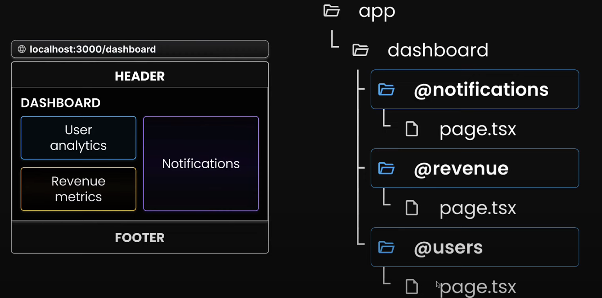
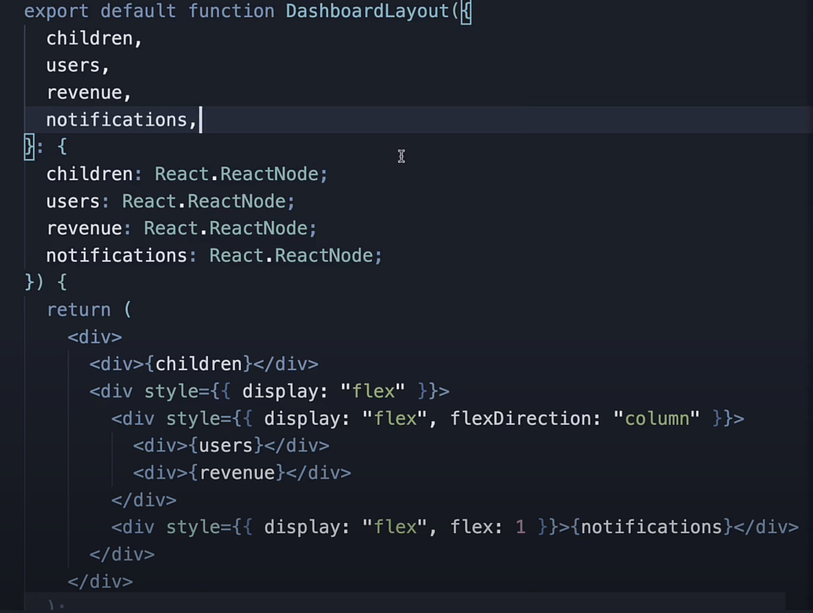
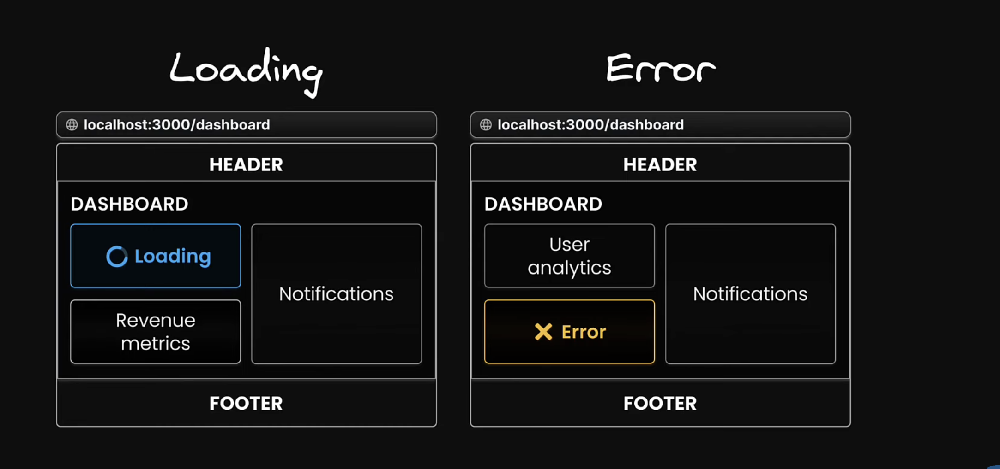
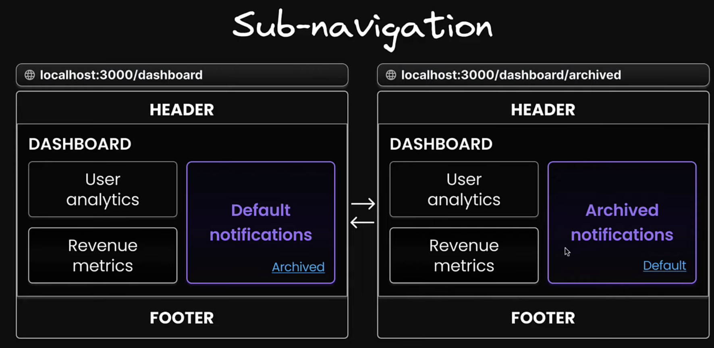
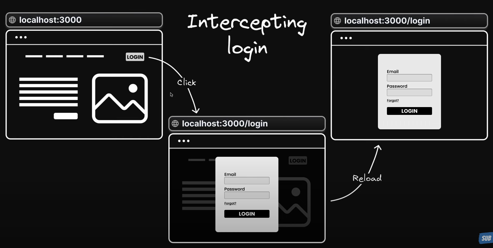
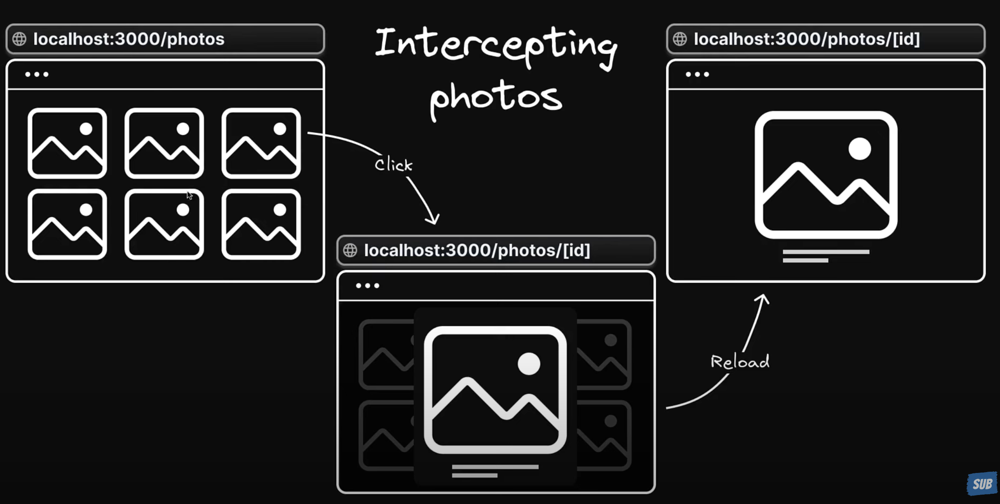
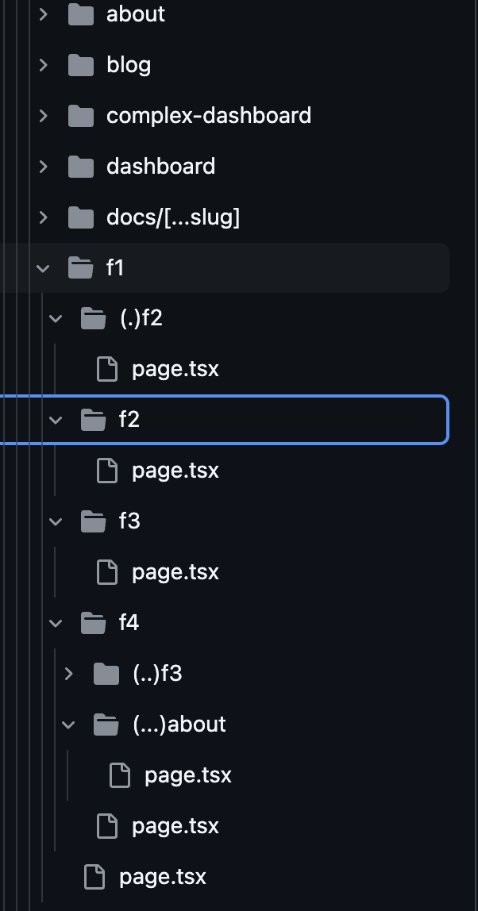
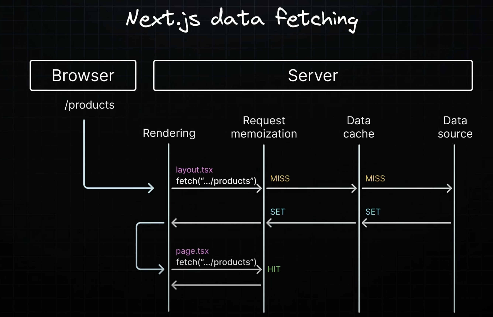

# Next.js

> Verified against the official Next.js docs (current stable: **16.2.x**). Version-sensitive claims are labeled — Next.js changed its caching defaults in v15 and introduced a new caching model in v16, so "cached by default" answers you'll find in older tutorials (and in earlier drafts of this file) are wrong for current apps.

---

## What is Next.js?

- A **React framework** — it uses React for the UI layer and adds everything a production app needs around it: routing, data fetching, bundling, compiling, optimized rendering.
- React alone only handles the *view*. Routing, data fetching, code splitting, and server rendering all have to be built or wired up by hand. Next.js gives you working defaults for all of that, following a set of file-system conventions rather than requiring an extra library.
- Two things worth being precise about in an interview: Next.js **is** React plus opinions, not a replacement for it — you still write React components. And "no additional library needed" means for the *framework-level* concerns (routing, data fetching, rendering strategy) — you'll still reach for state management, UI libraries, etc. as usual.

### Core features

- Routing (file-system based)
- API Routes / Route Handlers
- Rendering — both server and client, mixed per-component
- Data fetching, with built-in caching primitives
- Styling (CSS Modules, Tailwind, Sass — all supported out of the box)
- Optimization (fonts, images, scripts)
- Dev and prod build pipelines (Turbopack, Webpack)

---

## Component Hierarchy

Inside the App Router, a route segment's special files nest in a fixed order. **Verified against the current docs** — the previous version of this note had `not-found` innermost and `error` outermost of the pair; the actual nesting is:

```
<Layout>
  <Template>
    <ErrorBoundary fallback={<Error />}>
      <Suspense fallback={<Loading />}>
        <ErrorBoundary fallback={<NotFound />}>
          <Page />
        </ErrorBoundary>
      </Suspense>
    </ErrorBoundary>
  </Template>
</Layout>
```

Files, outermost to innermost: `layout.tsx` → `template.tsx` → `error.tsx` → `loading.tsx` → `not-found.tsx` → `page.tsx`.

**One precise detail the diagram implies but is easy to miss:** `error.js` wraps `loading.js`, `not-found.js`, `page.js`, and any nested `layout.js` — but it does **not** wrap the `layout.js` or `template.js` at its *own* segment level. An error thrown inside a layout's own render (not its children) won't be caught by the `error.js` sitting next to it — it bubbles up to the parent segment's boundary, or to `global-error.js` at the root. This is also why an error boundary can't be added for the root layout itself using a normal `error.tsx` (§ below).

---

## Server Components

- **All components and pages are Server Components by default** in the App Router.
- Can run server-only work directly: read files, query a database, call an API with a secret key — all without shipping that code to the browser.
- **Cannot** use hooks (`useState`, `useEffect`, etc.) or attach event handlers (`onClick`, `onChange`) — there's no client-side runtime for them to run in.

Add `'use client'` at the top of a file to opt a component (and its whole module subtree) into being a Client Component.

**A subtlety worth stating precisely:** `'use client'` marks a **boundary**, not every individual component below it. Once a file has the directive, everything it imports *and directly renders* becomes part of the client bundle — you don't need to re-add the directive to every child. The one exception is a Server Component passed in as `children` or another prop (see Interleaving, below) — that one is **not** pulled into the client module graph, because it isn't imported by the client file, only referenced as already-rendered output.

**Notes:**
- For a custom global 404 page, add `not-found.tsx` inside the `app` folder.
- For a route-specific 404, add `not-found.tsx` in that route's folder and call `notFound()` from `page.tsx` to trigger it.

---

## Folder naming conventions inside `app`

| Convention | Meaning |
|---|---|
| `[id]` | Dynamic route segment |
| `[...params]` | Catch-all — matches all segments *after* this point |
| `[[...params]]` | Optional catch-all — matches this route *and* all segments after it |
| `_folderName` | Private folder — excluded from routing |
| `(folderName)` | Route group — organizes routes without affecting the URL (e.g. grouping `login`/`signup` under an `(auth)` folder) |
| `@folderName` | Parallel route slot |

---

## Metadata configuration

Export a static `metadata` object, or a dynamic `generateMetadata` function, from `layout.tsx` or `page.tsx`.

**Metadata rules:**
- Both `layout.tsx` and `page.tsx` can export metadata. Layout metadata applies to every page under it; page metadata applies only to that page.
- Metadata is read **top-down** — from the root layout to the final page.
- When the same field is set in multiple places, the values are merged, and the **page-level value wins** over the layout-level one for any overlapping property.

```tsx
import type { Metadata } from 'next';

type Props = {
  params: Promise<{ productId: string }>;   // params is a Promise — see note below
};

export const generateMetadata = async ({ params }: Props): Promise<Metadata> => {
  const { productId } = await params;
  return { title: `Product ${productId}` };
};

export default async function ProductDetails({ params }: Props) {
  const { productId } = await params;
  return <h1>Details about product {productId}</h1>;
}
```

> **Version note:** since Next.js 15, `params` and `searchParams` are **asynchronous** — you must `await` them, in both `page.tsx` and `generateMetadata`. Older code (and the previous version of this file) that reads `params.productId` synchronously will show a warning today and break in a future major version.

---

## Error handling

- To show a plain fallback UI when something crashes, add an `error.tsx` file. **Error boundaries must be Client Components** — Next.js requires `'use client'` at the top.
- To let the user retry without a full reload, use the `unstable_retry` function passed as a prop (current API — replaces the older pattern of manually re-rendering via `reset`, which still exists but `unstable_retry` is now preferred: it re-fetches and re-renders the boundary's children rather than just clearing local error state).

```tsx
'use client';

export default function ErrorBoundary({
  error,
  unstable_retry,
}: {
  error: Error & { digest?: string };
  unstable_retry: () => void;
}) {
  return (
    <div>
      {error.message}
      <button onClick={() => unstable_retry()}>Try again</button>
    </div>
  );
}
```

**Note:** an `error.tsx` can't catch errors thrown by the **root layout itself**, since the root layout has nothing above it to render a fallback in its place — that's what `global-error.tsx` at the app root is for. It must define its own `<html>` and `<body>` tags, since it fully replaces the root layout when active.

---

## Templates vs Layouts

Similar shape, different lifecycle:

- A **layout** persists across navigations within it — state is preserved, DOM elements are not recreated, effects don't re-run.
- A **template** is remounted whenever its own route segment's key changes (which includes dynamic params changing) — a fresh component instance, so:
  - Client Component state resets
  - DOM elements are fully recreated
  - Effects (`useEffect`) re-synchronize

**Precisely when a template remounts:** it's keyed to its segment, not to "any navigation." Navigating to a *different* child segment under the same template remounts that template; navigating within a segment that doesn't change (e.g. only search params change) does not. If you have nested templates, only the ones whose segment actually changed remount — parent templates whose segment is unaffected stay mounted.

File name: `template.tsx`. Use it when you need per-navigation effect resync or state reset — a search input that should clear on every page change, for example.

---

## Parallel Routes

- Defined using **slots**.
- Lets you structure a layout into independently-rendered sections.
- A slot is a folder prefixed with `@` (e.g. `@analytics`, `@team`).
- Each slot is passed to the parent `layout.tsx` as a **prop** with the slot's name.




### Benefits (example: a complex dashboard)

**Independent route handling** — each slot can have its own `loading.tsx` and `error.tsx`, so slower or error-prone sections don't block or crash the rest of the page.



**Sub-navigation per slot** — each slot behaves like a mini app with its own navigation and state, letting the user move around one part of the dashboard without a full reload or layout shift.



### Unmatched routes in parallel routes

- **Client-side navigation:** Next.js retains a slot's last active state even if the URL no longer matches it.
- **Full page reload:** Next.js looks for a `default.tsx` in each unmatched slot. This file supplies fallback content when the slot's active state can't be derived from the current URL. If it's missing, Next.js renders a 404 for that slot. In most cases `default.tsx` is close to a copy of that slot's `page.tsx`.

---

## Intercepting Routes

Lets you intercept normal navigation to show an alternate view (e.g. a modal) while preserving the real route underneath — so a full page reload still lands on the actual destination, not the intercepted view.




**Route conventions:**

| Convention | Matches |
|---|---|
| `(.)` | Same level |
| `(..)` | One level above |
| `(..)(..)` | Two levels above |
| `(...)` | From the root `app` directory |

Folder names must follow the convention exactly.



📚 [Intercepting Routes docs](https://nextjs.org/docs/app/building-your-application/routing/intercepting-routes)

---

## Rendering

### CSR, SSR — the fundamentals

Covered in depth, with runnable proof, in the [React Mastery course — Module 7](./React/Module07-Rendering.md). Short version, Next.js-flavored:

- **CSR** — server sends a near-empty HTML shell plus a `bundle.js`. The browser downloads and runs the JS, which builds the DOM and fetches data. Bad for SEO (little to index) and for load time (everything gated on the bundle).
- **SSR** — the server renders full HTML for the request and sends that instead. Good for SEO and first paint. The page isn't interactive until the JS bundle has downloaded and **hydrated** it — React reconstructs its component tree over the static HTML, attaches event handlers, and initializes state.

### Server-side rendering strategies

- **Static Site Generation (SSG)** — pages rendered once, **at build time**. Ideal for content that rarely changes (blog posts, docs).
- **Server-Side Rendering (SSR)** — pages rendered **per request**. Needed for personalized content (a logged-in user's feed) where the HTML depends on request-time data.

### The pre-Suspense "all-or-nothing" problem

Before streaming SSR and Suspense, SSR had three compounding waterfalls:

1. **Fetch everything before rendering anything** — a component can't start rendering and pause for its data; all data for the page had to be ready before the server could send any HTML.
2. **Load everything before hydrating anything** — hydration required the full client-side component tree, which meant all the JS for every component had to load first.
3. **Hydrate everything before interacting with anything** — hydration ran in one uninterruptible pass, so no part of the page was interactive until the whole tree was done.

In brief: fetch → load JS → hydrate, each step gated on completing the *whole* page, not just the part the user cares about. Slow parts of the app blocked fast parts, end to end.

### Suspense SSR — selective hydration

`<Suspense>` breaks that chain. Wrapping a slow section means it no longer blocks the rest of the page from **streaming or hydrating**.

- Sections stream in and hydrate **as they become ready**, instead of waiting for the whole page.
- The rest of the page — header, nav, anything not gated on the slow part — becomes interactive without waiting for the heavy section.
- If multiple sections are still waiting to hydrate, React **prioritizes based on user interaction** — clicking into a not-yet-hydrated section bumps its priority. This is the same lanes-based scheduling mechanism covered in the React course's [Module 3 §6](./React/Module03-FiberArchitecture.md) and [Module 12](./React/Module12-Internals.md), applied to hydration specifically.

**Remaining limitations, even with Suspense:**

1. The full page's JS still has to be downloaded eventually — streaming spreads out *when* code arrives, not *how much* total code exists.
2. Every Client Component still hydrates on the client, whether it needs interactivity or not — no way (at the React/Suspense level alone) to skip hydrating something purely static.
3. Even with the server doing the heavy lifting elsewhere, most JS execution still happens on the user's device — a real cost on low-power hardware.

### Evolution

```
CSR → SSR → Suspense SSR (streaming + selective hydration) → React Server Components
```

Each step closed a real gap, but Suspense SSR still left: large bundles, unnecessary hydration of non-interactive parts, and heavy client-side execution. React Server Components exist to address exactly those three.

---

## React Server Components (RSC)

Two component types, distinguished by **where they run**, not by what they do:

### Client Components

- Can render on the client (CSR) but are also typically rendered once on the server (as an optimization) so the user sees real HTML immediately instead of a blank page.
- Have access to the browser environment — state, effects, event listeners, and browser-only APIs (`localStorage`, geolocation).

### Server Components

- Run **exclusively** on the server. Their code never ships to the client — not even a reference, unlike Client Components which ship as JS the browser executes.

**Benefits:**

1. **Smaller client bundles** — server-only code and its dependencies never leave the server, which especially helps users on slow connections or weak devices. It also removes the hydration step for that content entirely.
2. **Direct backend access** — databases, file systems, internal services, all reachable without an intermediate API layer.
3. **Better security** — secrets, tokens, and API keys stay server-side by construction, not by discipline.
4. **No client-server data waterfalls** — a `useEffect`-based fetch chain means a child can't start fetching until its parent has finished. Moving that sequencing to the server keeps the round trips server-to-server (fast, same network) instead of client-to-server repeated (slow, per round trip over the user's connection).
5. **Cacheable output** — results can be cached and reused across requests and users, cutting repeated rendering and data-fetching work.
6. **Faster FCP** — HTML generated server-side is visible immediately, with no wait for JS download/parse/execute first.
7. **Better SEO** — crawlers get fully-formed HTML directly.
8. **Streamable** — rendering can be split into chunks and sent as each becomes ready, rather than waiting for the entire page.

---

## Rendering strategies — verified against current docs

> ⚠️ **This is the section that had actually drifted.** Next.js 15 flipped a caching default, and Next.js 16 introduced an entirely new model. Both matter for correctness.

### Static Rendering

- HTML generated **at build time**, cached by a CDN, served near-instantly.
- Along with the HTML, an **RSC payload** is produced for each component, plus JS chunks for hydrating Client Components in the browser.
- Direct navigation to a static route serves the pre-built HTML (with its JS chunk) straight from the server/CDN.
- Client-side navigation *to* a static route uses the already-**prefetched** RSC payload and JS chunks — no additional server round trip.
- This is the **default** rendering mode in the App Router: every route is statically prepared at build time unless something forces it dynamic.

**Prefetching:** routes are automatically prefetched in the background as their links enter the viewport (on load or on scroll). For fully static routes, the whole route is prefetched and cached — e.g. loading the homepage prefetches the linked About and Dashboard routes so navigating to them feels instant.

### Dynamic Rendering

- Routes rendered **per request**, for content that's personalized or only knowable at request time — cookies, search params, per-user data.
- Calling a **dynamic API** — `cookies()`, `headers()`, or reading `searchParams` — inside a route switches that whole route to dynamic rendering.

> **Version note:** since Next.js 15, these dynamic APIs (`cookies()`, `headers()`, `draftMode()`, and `params`/`searchParams`) are **asynchronous** — `await cookies()`, not `cookies()`. Older synchronous usage triggers a deprecation warning today.

### Streaming

- Splits rendering work into chunks streamed to the client as each becomes ready, rather than sending the whole page at once.
- Lets users see and interact with parts of the page immediately, and keeps a slow data-dependent section from blocking the rest of the route.

---

## Data fetching and caching — corrected for current defaults

This is where the file was actively wrong, so being explicit about **which Next.js version** each claim applies to matters.

### The default flipped in Next.js 15

| | Next.js ≤14 | Next.js 15+ |
|---|---|---|
| `fetch()` default | **Cached** unless opted out | **Not cached** unless opted in |
| `GET` Route Handlers | Cached by default | Not cached by default |
| Client Router Cache (Page segments) | Cached | `staleTime: 0` — always fresh on navigation |

**If you're reading a Next.js tutorial (including earlier drafts of this file) that says "fetch is cached by default," that statement is only true for Next.js 14 and earlier.** On 15+, the opposite is true — you opt **into** caching, not out of it.

```tsx
// Next.js 15+: explicitly opt into caching
const data = await fetch('https://api.example.com/data', { cache: 'force-cache' });

// Next.js 15+: default behavior — NOT cached, refetched every request
const data = await fetch('https://api.example.com/data');
```

**Route-level control** (works the same across 15 and 16's pre-Cache-Components model):

```tsx
export const dynamic = 'auto';         // default: cache what's safely cacheable
// 'force-dynamic' | 'error' | 'force-static' are the other options
```

### Next.js 16: Cache Components (the current model)

Next.js 16 introduces an opt-in flag, `cacheComponents: true`, that replaces manual `fetch` cache options with a directive-based model:

```ts
// next.config.ts
const nextConfig = { cacheComponents: true };
```

With it enabled, you cache explicitly with `"use cache"` — at the data level or the component level:

```tsx
// Data-level
export async function getUsers() {
  'use cache';
  return db.query('SELECT * FROM users');
}

// UI-level — caches the whole component's rendered output
export default async function Page() {
  'use cache';
  const users = await db.query('SELECT * FROM users');
  return <UserList users={users} />;
}
```

Anything reading a **runtime API** (`cookies()`, `headers()`, `searchParams`) must be wrapped in `<Suspense>` — it can't be cached, since its value is only known per-request:

```tsx
import { cookies } from 'next/headers';
import { Suspense } from 'react';

async function UserGreeting() {
  const theme = (await cookies()).get('theme')?.value ?? 'light';
  return <p>Theme: {theme}</p>;
}

export default function Page() {
  return (
    <Suspense fallback={<p>Loading…</p>}>
      <UserGreeting />
    </Suspense>
  );
}
```

This is called **Partial Prerendering (PPR)** — static and cached parts become part of a prebuilt shell; runtime-dependent parts stream in per request. It's the default behavior once Cache Components is enabled.

**Which model applies to you:** if `cacheComponents` isn't set, you're on the pre-16 model (fetch options + route segment config, uncached by default since v15). If it is set, you're on the directive-based model above. Check `next.config.ts` before assuming either.

---

## Request Memoization

Distinct from the caching mechanisms above — this operates **within a single render pass**, not across requests.

- Deduplicates identical requests made multiple times during **one render** (GET requests only for `fetch`; use React's `cache()` for non-`fetch` data access like a direct DB call).
- The first call actually fetches and stores the result in memory for that render.
- Every subsequent call for the same data in that same render pass reads from memory instead of re-fetching.
- Useful because the same data is often needed by multiple components in a tree (a layout and a page both wanting the current user, for instance) — without this, that's N network calls instead of one.

```tsx
import { cache } from 'react';

export const getPost = cache(async (id: string) => {
  return db.query.posts.findFirst({ where: eq(posts.id, id) });
});
```

Calling `getPost(id)` from multiple components in the same render, with the same `id`, only hits the database once.



---

## Server-only and Client-only code

**Server-only code:** if a function meant to run only on the server (e.g. one using a secret API key) gets imported into a Client Component, Next.js throws a compile-time error rather than letting it leak silently. Enforce this explicitly with the `server-only` package — importing it at the top of a file makes any accidental client import fail the build with a clear message.

**Client-only code:** the reverse problem — code touching `window`, the DOM, or `localStorage` will error if it executes during server rendering. The `client-only` package provides the same explicit guard in the other direction.

Both packages are optional — Next.js already prevents secrets from leaking to the client bundle (only `NEXT_PUBLIC_`-prefixed env vars are ever included; see the React course's [Module 14a](./React/Module14a-BuildPipelineEndToEnd.md) for how that actually works under the hood) — but they turn a silent runtime surprise into a build-time error, which is worth having.

---

## Context in Next.js

- Context providers are typically rendered near the root of the app, to share global state like the current theme across everything below.
- **React Context is not supported in Server Components.** Creating a context directly at the app root (a Server Component by default) throws an error.
- The fix: create the context **and its provider** inside a dedicated Client Component (`'use client'`), then import and render that provider from a Server Component like the root layout. Once rendered, every Client Component beneath it can consume the context normally.

```tsx
// app/theme-provider.tsx
'use client';
import { createContext } from 'react';

export const ThemeContext = createContext({});

export default function ThemeProvider({ children }: { children: React.ReactNode }) {
  return <ThemeContext.Provider value="dark">{children}</ThemeContext.Provider>;
}
```

```tsx
// app/layout.tsx — a Server Component, rendering the Client provider
import ThemeProvider from './theme-provider';

export default function RootLayout({ children }: { children: React.ReactNode }) {
  return (
    <html>
      <body>
        <ThemeProvider>{children}</ThemeProvider>
      </body>
    </html>
  );
}
```

> **Good to know** (from the official docs): render providers as **deep** in the tree as reasonable — wrap only `{children}`, not the whole `<html>` document. It keeps more of the static parts of your Server Component tree optimizable, since everything below a Client Component boundary is pulled into the client bundle.

---

## Interleaving Server and Client Components

The rules, verified against current docs:

| Pattern | Result |
|---|---|
| Server Component inside a Server Component | ✅ Works |
| Client Component inside a Client Component | ✅ Works |
| Client Component inside a Server Component (server parent, client child) | ✅ Works |
| Server Component **imported and rendered directly** inside a Client Component | ❌ Not allowed |

**Why the last case fails, precisely:** once a file has `'use client'`, everything it *imports and directly renders* is pulled into the client module graph — the boundary applies to the whole subtree of things that file brings in, not just the top component. A Server Component imported and rendered that way would need to ship its code to the client too, which defeats the entire point of a Server Component (its code is meant to *never* leave the server).

**The workaround: pass the Server Component in as `children` (or another prop), don't import and render it inside the Client Component's own body.**

```tsx
// app/interleaving-page.tsx — a Server Component
import { ClientComponentOne } from '@/components/client-component-one';
import { ServerComponentOne } from '@/components/server-component-one';

export default function InterleavingPage() {
  return (
    <>
      <h1>Interleaving Page</h1>
      <ClientComponentOne>
        <ServerComponentOne />
      </ClientComponentOne>
    </>
  );
}
```

```tsx
// components/client-component-one.tsx
'use client';
import { useState } from 'react';

export const ClientComponentOne = ({ children }: { children: React.ReactNode }) => {
  const [name, setName] = useState('Batman');
  return (
    <>
      <h1>ClientComponentOne</h1>
      {children}
    </>
  );
};
```

`<ServerComponentOne />` is rendered on the server **before** `<ClientComponentOne>` ever runs on the client — it's resolved to its rendered output (part of the RSC payload) and passed down as `children`, so `ClientComponentOne` never has to import it, and its code never enters the client bundle. This is the same `children`-as-a-slot pattern used for Context providers and the parallel-routes pattern above — passing already-rendered output across the server/client boundary instead of importing across it.

---

## Interview Questions

**Q: Is `fetch` cached by default in Next.js?**
⚠️ *Trap — the answer depends entirely on version, and most people answer from outdated memory.* Through Next.js 14, yes, cached by default. **Since Next.js 15, no** — `fetch` is uncached by default, and you opt in with `{ cache: 'force-cache' }`. Next.js 16 goes further with an opt-in `cacheComponents` model using `"use cache"` directives instead of per-fetch options. Always check the project's Next.js version before answering this one.

**Q: What's the difference between SSR and React Server Components?**
SSR renders on the server but still ships the component's JS to the client for hydration. Server Components run exclusively on the server — their code never reaches the client at all, only their rendered output does. (Full treatment: [React course Module 7 §7](./React/Module07-Rendering.md).)

**Q: Why can't you import a Server Component inside a Client Component?**
Because `'use client'` marks a module-graph boundary — anything that file imports and directly renders is pulled into the client bundle. A Server Component is defined by its code never leaving the server, so importing it there is a contradiction. Pass it as `children` or a prop instead; it renders server-side ahead of time and reaches the client only as already-rendered output.

**Q: Why doesn't React Context work in a root Server Component?**
Context needs a Provider component holding client-side reactive state machinery that Server Components can't run. Create the context and its Provider in a `'use client'` file, then render that provider from the Server Component — everything under it in the tree can consume the context normally.

**Q: What's the actual difference between a layout and a template?**
A layout persists across navigations within it — state, DOM nodes, and effects survive. A template remounts whenever its own route segment's key changes (including a dynamic param changing), giving each navigation a fresh instance — useful for resetting a Client Component's state or resynchronizing an effect on every page change.

**Q: What problem do Suspense SSR and selective hydration solve?**
Before them, SSR was all-or-nothing at three separate points: all data had to be fetched before any HTML could send, all client JS had to load before hydration could start, and hydration ran in one uninterruptible pass. `<Suspense>` boundaries let sections stream and hydrate independently, and React prioritizes hydrating whichever section the user actually interacts with first.

---

## Common Mistakes

- ❌ Assuming `fetch` is cached by default on a current (15+) Next.js project — it isn't, and that's a reversal of the pre-15 behavior most tutorials still describe.
- ❌ Reading `params`/`searchParams`/`cookies()`/`headers()` synchronously — all asynchronous since Next.js 15.
- ❌ Importing and rendering a Server Component directly inside a Client Component's body — pass it as `children`/a prop instead.
- ❌ Creating a Context directly in a root Server Component — wrap the provider in its own `'use client'` file.
- ❌ Expecting an `error.tsx` to catch errors thrown by the `layout.tsx`/`template.tsx` sitting at its own segment level — it only catches what's nested *inside* it.
- ❌ Confusing "template resets on every navigation" with the precise rule — it resets when its **own segment's key** changes, not on every navigation everywhere in the app.

---

## References

- [Server and Client Components](https://nextjs.org/docs/app/getting-started/server-and-client-components)
- [Caching (Cache Components model)](https://nextjs.org/docs/app/getting-started/caching) · [Caching and Revalidating — Previous Model](https://nextjs.org/docs/app/guides/caching-without-cache-components)
- [`template.js`](https://nextjs.org/docs/app/api-reference/file-conventions/template) · [`error.js`](https://nextjs.org/docs/app/api-reference/file-conventions/error)
- [Intercepting Routes](https://nextjs.org/docs/app/building-your-application/routing/intercepting-routes)
- [Next.js 15 release notes](https://nextjs.org/blog/next-15) — the caching default change and async request APIs

**Related in this repo:** [React Mastery course](./React/README.md) — Module 7 (Rendering Patterns) and Module 14a (Build Pipeline) cover the React-side mechanics referenced throughout this file in more depth, with verified code output rather than prose claims.
