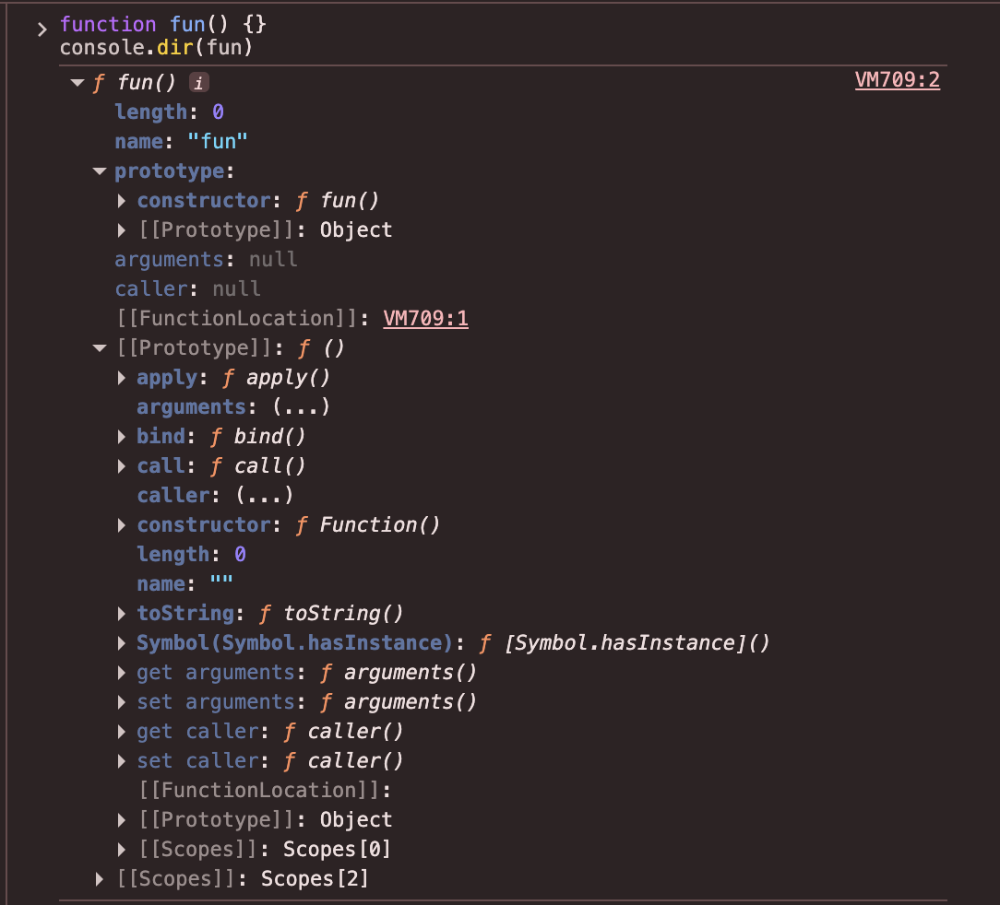
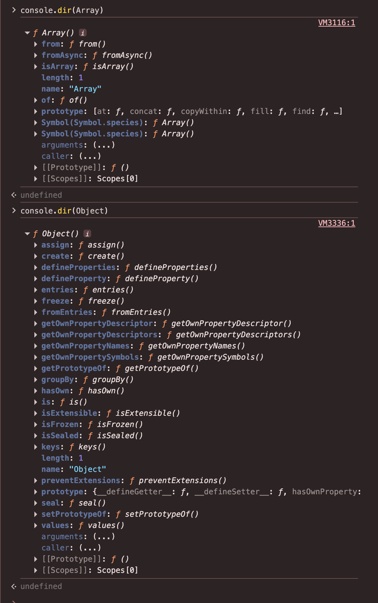

# Prototypal Inheritance, `new`, and the Origins of `class`

## Is Everything in JS an Object?

No — everything in JS *tries* to behave like an object (falling back to a temporary wrapper object for property/method access, e.g. `"abc".toUpperCase()`), but primitives like `null` and `undefined` are the exception: they have no wrapper object and no prototype chain at all. That's why calling a method on either of them throws, instead of silently resolving through some chain:

```javascript
null.toString();
undefined.toString();
```

```
TypeError: Cannot read properties of null (reading 'toString')
TypeError: Cannot read properties of undefined (reading 'toString')
```

## Interlude: Functions Are Both Objects and Functions

### Question 1

```javascript
function multiplyBy2(num){
 return num*2
}
multiplyBy2.stored = 5
multiplyBy2(3)
multiplyBy2.stored
multiplyBy2.prototype
```

<details><summary>Show Answer</summary>

```
6
5
{}
```

When we define a function, in the memory allocation phase the function is assigned memory and its entire code is stored as a placeholder. A function can also be thought of as an object with a **`prototype`** property, which is itself an object.

We can use the fact that all functions have a default property on their object version, `prototype`, which is itself an object — to replace our `functionStore` object.


</details>

## `[[Prototype]]`, `__proto__`, `prototype`, and `constructor`

- Every function has a `prototype` property.
- That `prototype` object itself has some default properties: a `constructor` property, and its own hidden `[[Prototype]]` property.
- `constructor` is a reference back to the function that created it — here, that's the same function whose `.prototype` we're looking at.



- Every object has a hidden `[[Prototype]]` property (not the same thing as `.prototype`, which only functions have).
- To read or set this hidden link, we use `__proto__` — plain property access like `obj["[[Prototype]]"]` doesn't work, since `[[Prototype]]` is an internal slot, not a real property key.
- `__proto__` is really a **getter/setter pair** defined on `Object.prototype` — accessing it triggers a function call under the hood, it isn't a plain data property.
- `__proto__` is considered legacy today. Prefer `Object.getPrototypeOf()` and `Object.setPrototypeOf()` instead.

## Functions Are Creators

Every object in JS is created by some function. The created object's `[[Prototype]]` gets linked to that function's `.prototype` property.

For example, when we create an object using `const obj = {}`, under the hood it behaves as if we wrote `const obj = new Object()` — so `obj`'s `[[Prototype]]` is linked to `Object.prototype`:

```javascript
const obj = {};
// const obj = new Object(); — behind the hood

console.log(obj.__proto__ === Object.prototype);
console.log(obj.__proto__.constructor === Object);
```

```
true
true
```

> **Note:** every *function* has a `.prototype` property — this applies uniformly to `Array`, `Object`, `Function`, and any function you write yourself. This is unrelated to the `Function` type name; `typeof Array === 'function'`, not `'Function'` — there's no separate `Function` datatype, just the `function` typeof tag shared by all callable values.



## Different Ways to Create an Object

### Question 2

```javascript
const user = {
    name: 'Rohit',
    score: 5,
    increment() {
        user.score++;
    }
}

user.increment()
console.log(user.score)
```

<details><summary>Show Answer</summary>

```
6
```

**Explanation:** Object literal syntax — the simplest way to create an object, with data and methods defined together.

</details>

### Question 3

```javascript
const user2 = {};
user2.name = "Ghost",
user2.score = 100,
user2.increment = function() {
    user2.score++
}
```

<details><summary>Show Answer</summary>

Creates an empty object via `{}` and adds properties/methods one at a time using dot notation.

</details>

### Question 4

```javascript
const user3 = Object.create(null); // what if null is not there
user3.name = "Alex",
user3.score = 200,
user3.increment = function() {
    user3.score++
}
```

<details><summary>Show Answer</summary>

`Object.create(null)` creates an object with **no prototype at all** — it doesn't inherit from `Object.prototype`, so it has no `toString`, `hasOwnProperty`, etc. If `null` weren't passed, `Object.create()` would default to linking the new object's `[[Prototype]]` to `Object.prototype`, the same as `{}`.

</details>

---

Our code is getting repetitive, we're breaking our DRY principle. And suppose we have millions of users! What could we do?

## Solution 1: Generate Objects Using a Function

### Question 5

```javascript
function userCreator(name, score) {
  const newUser = {};
  newUser.name = name;
  newUser.score = score;
  newUser.increment = function() {
    newUser.score++;
  };
  return newUser;
};
const user1 = userCreator("Rohit", 5);
const user2 = userCreator("Ghost", 100);
const user3 = userCreator("Alex", 200)
user1.increment()
user2.increment()
user3.increment()
console.log(user1.score)
console.log(user2.score)
console.log(user3.score)
```

<details><summary>Show Answer</summary>

```
6
101
201
```

**Problem:** Each time we create a new user we make space in memory for all our data *and* functions. The data is unique so it needs its own space, but the functions are just copies — every object gets its own copy of `increment`. If we had multiple functions (`increment`, `decrement`, `login`, `logout`, etc.), every object in the GEC would carry its own identical copy of each. All these methods should refer to a single shared one.

</details>

## Solution 2: Share Methods via `Object.create()`

Store the `increment` function in just one object and have the interpreter look it up — if it doesn't find the function on `user1`, look up to the object it's linked to.

> **Note:** The only goal we have in Object Oriented Programming is: can we bundle up the appropriate and relevant functionalities with the relevant data it applies to? Not have to go hunt off in another part of our file for a particular function, but just bundle them up together.

### Question 6

```javascript
function userCreator (name, score) {
  const newUser = Object.create(userFunctionStore);
  newUser.name = name;
  newUser.score = score;
  return newUser;
};
const userFunctionStore = {
  increment: function(){
    this.score++;
  },
  login: function(){
    console.log("You're loggedin");
  }
};
const user1 = userCreator("Phil", 4);
const user2 = userCreator("Julia", 5);
user1.increment();
```

<details><summary>Show Answer</summary>

If we console `user1` or `user2`, we'd see a new **`[[Prototype]]`** added to the object in dev tools. JS uses the prototype chain feature to access the common function — `increment` and `login` live once on `userFunctionStore`, and every user created via `userCreator` is linked to it via `Object.create`.

![DevTools: `user1` with own properties and `[[Prototype]]` showing `increment` and `login`](../../Assests/prototype-added-using-object.create.png)

Here we had to do all the manual linking ourselves — create an object, return an object. This problem gets solved using the `new` operator.

</details>

## Solution 3: Introducing `new` — Automating the Manual Linking

```javascript
const user1 = new userCreator("Phil", 4)
```

When we call the constructor function with `new` in front, we automate three things:

1. Create a new object `this`.
2. Add a `__proto__` reference on `this` and link it to the constructor's `.prototype`.
3. Return the new object `this` (implicitly).

The `new` keyword automates a lot of manual work:

```
 function userCreator(name, score) {
   ~~const newUser = Object.create(functionStore);~~
   ~~newUser~~ this.name = name;
   ~~newUser~~ this.score = score;
   ~~return newUser;~~
 }

 let user1 = new userCreator("Phil", 4);
```

## Complete Solution 3

### Question 7

```javascript
function UserCreator(name, score){
 this.name = name;
 this.score = score;
}

UserCreator.prototype.increment = function(){
 this.score++;
};

UserCreator.prototype.login = function(){
 console.log("login");
};

const user1 = new UserCreator("Eva", 9)
user1.increment()
```

<details><summary>Show Answer</summary>

Methods are attached to `UserCreator.prototype` instead of a plain `functionStore` object. Every instance created with `new UserCreator(...)` gets its `[[Prototype]]` linked to `UserCreator.prototype` automatically, so `increment` and `login` are shared across all instances without manual `Object.create` wiring.


</details>

---

## What About This Way of Definition?

### Question 8

```javascript
function UserCreator(name, score){
  this.name = name;
  this.score = score;

  this.increment = function(){
    this.score++;
  };

  this.login = function(){
    console.log("login");
  };
}

const user1 = new UserCreator("Eva", 9);
user1.increment();
```

<details><summary>Show Answer</summary>

This works, but it's back to the own-copy problem: `increment` and `login` are assigned directly with `this.` inside the constructor, so a fresh copy of each function is created for every instance, instead of being shared through the prototype chain. See the comparison below.

</details>

### Prototype Methods vs. Own-Copy Methods in JavaScript

**Prototype Method Version**

```javascript
UserCreator.prototype.increment = function(){ ... }
UserCreator.prototype.login = function(){ ... }
```

1. `name` and `score` are stored directly inside each object.
2. `increment` and `login` are **not** stored inside each object.
3. These methods are stored on `UserCreator.prototype`.
4. All instances share the same methods.
5. More memory efficient.

Important point: the methods are created only once — every object accesses them through the prototype chain.

**Own-Copy Method Version**

```javascript
this.increment = function(){ ... }
this.login = function(){ ... }
```

1. `name` and `score` are stored directly inside each object.
2. `increment` and `login` are also stored directly inside each object.
3. Every time a new object is created, new copies of these methods are created.
4. Uses more memory.

Important point: the methods are recreated for every instance.

### Question 9

```javascript
const user1 = new UserCreator("Eva", 9);
const user2 = new UserCreator("Sam", 5);

console.log(user1.increment === user2.increment);
```

<details><summary>Show Answer</summary>

```
true   // In prototype version
false  // In own-copy version
```

**Explanation:** In the prototype approach, methods are shared (both instances point to the exact same function on `UserCreator.prototype`); in the own-copy approach, methods are recreated for every object, so they're different function references.

</details>

---

## Calling Prototype Methods

Each function execution context has `this` in its local context — follow the rules to find out what it points to.

### What If We Organize Our Code Inside a Shared Method by Defining a New Inner Function?

### Question 10

```javascript
function UserCreator(name, score){
 this.name = name;
 this.score = score;
}
UserCreator.prototype.increment = function(){
 function add1(){
 this.score++;
 }
 add1()
};
UserCreator.prototype.login = function(){
 console.log("login");
};
const user1 = new UserCreator("Eva", 9)
user1.increment()
```

<details><summary>Show Answer</summary>

In real scenarios, there can be multiple sub-functions inside a method which we group or break down into smaller chunks. But what `this` points to in these broken-down functions inside the method is *interesting*.

The `increment` method on the prototype has `this` referring to `user1` since it's called as `user1.increment()`. But `increment` then calls `add1()` as a plain function call — so inside `add1`, `this` refers to `window` (or `undefined` in strict mode), since there's nothing before `add1()` when it's invoked.


**Problem:** calling functions inside a method had `this` pointing to `window` instead of the user object.

</details>

## Solving This Using Arrow Functions

Arrow functions bind `this` lexically — `this` inside an arrow function points to the scope where it was defined/born/saved.

### Question 11

```javascript
function UserCreator(name, score){
 this.name = name;
 this.score = score;
}
UserCreator.prototype.increment = function(){
 const add1 = () => { this.score++ }
 add1()
};
UserCreator.prototype.login = function(){
 console.log("login");
};
const user1 = new UserCreator("Eva", 9)
user1.increment()
```

<details><summary>Show Answer</summary>


`add1` is an arrow function, so it doesn't have its own `this` — it points to its lexical scope, i.e. the `increment` function, or in other words, wherever it was defined. So `this` inside `add1` is the same as `this` inside `increment` (which correctly refers to `user1`).

</details>

---

> We're writing our shared methods separately from our object "constructor" itself (off in the `UserCreator.prototype` object). ES2015 lets us do so too, using classes.

## The `class` "Syntactic Sugar"

### Question 12

```javascript
class UserCreator {
 constructor (name, score) {
  this.name = name;
  this.score = score;
 }

 increment () {
  this.score++;
 }

 login () {
  console.log("login");
 }

}
const user1 = new UserCreator("Eva", 9);
user1.increment();
```

<details><summary>Show Answer</summary>

This works exactly the same way under the hood as the prototype method version above — `class` doesn't introduce a new inheritance model, it's syntactic sugar over the constructor-function + `.prototype` pattern. Methods declared in the class body are placed on `UserCreator.prototype`, just as before.

</details>

---

JavaScript uses this `[[Prototype]]` link to give objects, functions, and arrays a bunch of bonus functionality. All objects by default have `__proto__`.

### Question 13

```javascript
const obj = {
 num : 3
}
obj.num
obj.hasOwnProperty("num") // Where's this method?
Object.prototype
```

<details><summary>Show Answer</summary>

```
3
true
{ hasOwnProperty: FUNCTION, ... }
```

With `Object.create` we override the default `__proto__` reference (which normally points to `Object.prototype`) and replace it with our own `functionStore`. But `functionStore` is itself an object, so *it* has a `__proto__` reference to `Object.prototype` — we've simply interceded in the chain, not broken it. That's why `hasOwnProperty` is still reachable.

</details>

### Question 14

Arrays and functions are also objects, so they get access to everything on `Object.prototype`, plus more goodies of their own.

```javascript
function multiplyBy2(num){
 return num*2
}
multiplyBy2.toString() // Where is this method?
Function.prototype
multiplyBy2.hasOwnProperty("score") // Where's this function?
Function.prototype.__proto__
```

<details><summary>Show Answer</summary>

```
"function multiplyBy2(num){\n return num*2\n}"
{ toString: FUNCTION, call: FUNCTION, bind: FUNCTION, ... }
false
Object.prototype // { hasOwnProperty: FUNCTION, ... }
```

`multiplyBy2` is a function, so its `[[Prototype]]` is `Function.prototype`, which supplies `toString`, `call`, `bind`, etc. `Function.prototype` is itself an object, so its own `[[Prototype]]` is `Object.prototype` — which is where `hasOwnProperty` comes from. This is the prototype chain: `multiplyBy2 → Function.prototype → Object.prototype → null`.

**Note:** `__proto__` is now considered a legacy accessor and isn't exposed the same way on every engine/spec version by default; prefer `Object.getPrototypeOf()`.

</details>

---

## Subclassing

### Using the Prototypal Way

### Question 15

```javascript
function userCreator (name, score){
  this.name = name
  this.score = score
}

userCreator.prototype.sayName = function() {
  console.log("I'm " + this.name);
}

userCreator.prototype.increment = function() {
  this.score++;
}

const user1 = new userCreator("Phil", 5);
const user2 = new userCreator("Tim", 4);

user1.sayName(); // "I'm Phil"

function paidUserCreator (paidName, paidScore, accountBalance) {
  userCreator.call(this, paidName, paidScore);
  // userCreator.apply(this, [paidName, paidScore])
  this.accountBalance = accountBalance;
}

paidUserCreator.prototype = Object.create(userCreator.prototype);

paidUserCreator.prototype.increaseBalance = function () {
  this.accountBalance++;
};

const paidUser1 = new paidUserCreator("Alyssa", 8, 25);
paidUser1.increaseBalance()
paidUser1.sayName() // "I'm Alyssa"
```

<details><summary>Show Answer</summary>

`paidUserCreator` "subclasses" `userCreator` manually:

1. `userCreator.call(this, paidName, paidScore)` borrows `userCreator`'s constructor logic to set `name`/`score` on the new `paidUserCreator` instance.
2. `paidUserCreator.prototype = Object.create(userCreator.prototype)` links `paidUserCreator.prototype`'s `[[Prototype]]` to `userCreator.prototype`, so paid users can call both `increaseBalance` (own prototype) and `sayName` (inherited from `userCreator.prototype`).


</details>

### Using `class`

### Question 16

```javascript
class userCreator {
  constructor (name, score) {
    this.name = name;
    this.score = score;
  }
  sayName () {
    console.log("I am " + this.name);
  }
  increment () {
    this.score++;
  }
}

const user1 = new userCreator("Phil", 4);
const user2 = new userCreator("Tim", 4);

user1.sayName()

class paidUserCreator extends userCreator {
  constructor(paidName, paidScore, accountBalance) {
    super (paidName, paidScore)
    this.accountBalance = accountBalance;
  }
  increaseBalance () {
    this.accountBalance++
  }
}

const paidUser1 = new paidUserCreator("Alyssa", 8, 25);
paidUser1.increaseBalance();
paidUser1.sayName();
```

<details><summary>Show Answer</summary>

`extends` does exactly what the manual `Object.create(userCreator.prototype)` wiring did above — it links `paidUserCreator.prototype`'s `[[Prototype]]` to `userCreator.prototype`. `super(paidName, paidScore)` does what `userCreator.call(this, paidName, paidScore)` did — it invokes the parent constructor with the new instance as `this`. Same mechanism, cleaner syntax.

</details>

For the `Object.create()` and `new` polyfill implementations, see [Polyfills.md](Polyfills.md#question-14--myobjectcreate).