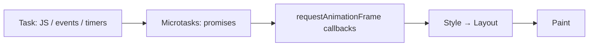
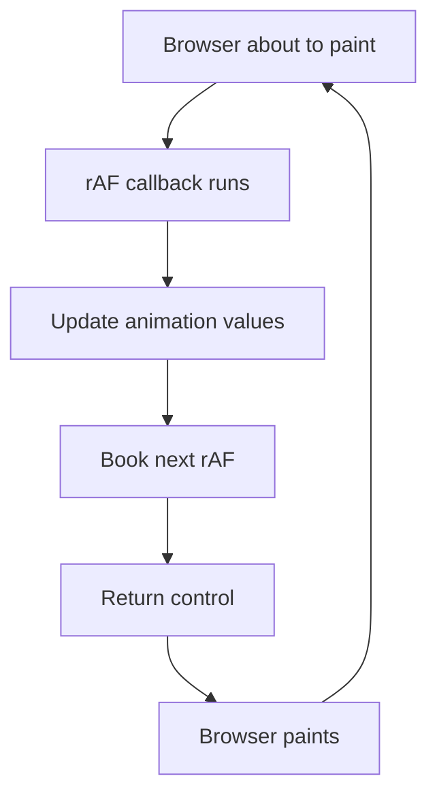

# requestAnimationFrame (rAF) — The Right Way to Animate in React

`requestAnimationFrame` is the browser API used to run code **just before the next screen repaint**.

Unlike `setTimeout` or `setInterval`, it is synchronized with the display refresh rate (60Hz, 120Hz, etc.), making animations smooth, accurate, and battery efficient.

---

## Why do we need it?

Imagine you want to animate a box across the screen.

### Using `setInterval`

```ts
setInterval(update, 16);
```

You are *asking* JavaScript to run every 16ms, but **JavaScript timers are not tied to rendering**. The 16ms is also a *minimum* delay, not a promise — if the main thread is busy, the timer just runs late.

```text
Time ───────────────────────────────────────────────▶

setInterval
   ●      ●       ●    ●        ●

Browser repaint
      │      │      │      │      │

Result:
❌ Timer and repaint are out of sync.
❌ Some frames get two updates (one is wasted work), some get none (a visible stutter).
```

Even if you choose `16ms`, it doesn't guarantee 60 FPS. And on a 120Hz screen, 16ms is the wrong number anyway.

### Using `requestAnimationFrame`

```ts
requestAnimationFrame(update);
```

Now the browser decides when to call your callback.

```text
Time ───────────────────────────────────────────────▶

Browser repaint
      │      │      │      │      │

rAF callback
      ●      ●      ●      ●      ●

Result:
✅ Exactly one callback right before each paint.
```

The browser automatically adapts to the screen:

- 60Hz → ~16.7ms per frame
- 120Hz → ~8.3ms per frame
- 144Hz → ~6.9ms per frame

You never hardcode frame timing.

> **Analogy:** `setInterval` is like a bus that leaves every 16 minutes no matter what, while the train (the repaint) leaves on its own schedule. Sometimes you miss the train, sometimes two buses arrive for one train. `requestAnimationFrame` is like the train conductor calling you: "we're leaving now, get on."

---

## Where rAF sits in a frame

Every frame follows roughly this order:



The important takeaway:

> **Your rAF callback runs just before the browser calculates styles and layout, then paints.**

That makes it the perfect place to update animation values: whatever you change is painted in that same frame.

### rAF and the event loop (interview favorite)

rAF callbacks are **neither macrotasks nor microtasks**. They run in the event loop's **rendering step**, which the browser only runs when it's about to paint (roughly once per refresh).

```javascript
setTimeout(() => console.log("timeout"));
requestAnimationFrame(() => console.log("rAF"));
Promise.resolve().then(() => console.log("microtask"));
console.log("sync");

// sync
// microtask
// then "timeout" and "rAF" — order is NOT guaranteed.
// It depends on how far away the next paint is.
```

`sync` and `microtask` always come first. Between `timeout` and `rAF`, whichever comes first depends on timing. Don't write code that depends on that order.

See also: [Event loop](eventLoop.md).

---

## The API

```ts
const id = requestAnimationFrame(callback);

cancelAnimationFrame(id);
```

The callback receives a timestamp:

```ts
requestAnimationFrame((timestamp) => {
  console.log(timestamp);
});
```

`timestamp` is a high-resolution time in milliseconds (same clock as `performance.now()`). It marks the start of the current frame, so **every rAF callback in the same frame gets the same timestamp**.

A key rule: **one call = one callback.** rAF does not repeat. If you want the next frame too, you must ask again.

---

## The React Pattern

```tsx
useEffect(() => {
  let frameId: number;

  const animate = () => {
    console.log("next frame");

    frameId = requestAnimationFrame(animate);
  };

  frameId = requestAnimationFrame(animate);

  return () => cancelAnimationFrame(frameId);
}, []);
```

This is the pattern you'll see in almost every animation library.

At first glance it looks recursive.

**It is — but not in the traditional sense.**

### Step 1 — Component mounts

When the component mounts:

```ts
frameId = requestAnimationFrame(animate);
```

This **does not execute `animate()`**.

Instead it tells the browser:

> "Call `animate` before the next repaint."

```text
useEffect()
     │
     ▼
requestAnimationFrame(animate)
     │
     ▼
Browser stores callback
```

The effect finishes immediately.

### Step 2 — Next frame

On a 60Hz screen, about 16ms later, the browser invokes `animate()`.

```ts
const animate = () => {
  console.log("next frame");

  frameId = requestAnimationFrame(animate);
};
```

Inside it:

1. Run the animation logic.
2. Schedule the next frame.
3. Return.

Notice carefully. This never happens:

```ts
animate(); // ❌ calling it yourself
```

Instead:

```ts
requestAnimationFrame(animate); // ✅ asking the browser to call it later
```

You're **scheduling**, not calling.

> **Gotcha:** calling `requestAnimationFrame` *inside* a rAF callback always schedules for the **next** frame, never the current one. That's what stops this pattern from turning into an infinite loop inside a single frame.

### Frame-by-frame timeline (60Hz)

```text
t = 0ms

useEffect
    │
    └── requestAnimationFrame(animate)


t ≈ 16ms

Before repaint
      │
      ▼
  animate()
      │
      ├── Update values
      └── requestAnimationFrame(animate)


t ≈ 33ms

Before repaint
      │
      ▼
  animate()
      │
      ├── Update values
      └── requestAnimationFrame(animate)


t ≈ 50ms

...
```

Every run finishes completely before the next one begins.

---

## Why doesn't this cause a stack overflow?

### Traditional recursion

```ts
function fn() {
  fn();
}
```

Call stack:

```text
fn()
 └── fn()
      └── fn()
           └── fn()
                ...   💥 RangeError: Maximum call stack size exceeded
```

Each call waits for the inner call to finish, so the stack keeps growing.

### rAF "recursion"

```ts
const animate = () => {
  requestAnimationFrame(animate);
};
```

What actually happens:

```text
Frame 1

animate()
  └── schedule next frame (just puts it in a list)

return  ← stack is now empty


Frame 2

animate()
  └── schedule next frame

return  ← stack is now empty


Frame 3

...
```

`requestAnimationFrame` doesn't call `animate`. It only adds it to a list and returns right away. So `animate` finishes, the stack empties, and the browser calls it again later from a fresh, empty stack. The stack depth is always 1.

> **rAF recursion is asynchronous, not immediate recursion.**

**Analogy:** normal recursion is a person holding the phone while calling a friend, who calls another friend, who calls another... everyone stays on the line. rAF is leaving a voicemail saying "call me back" and hanging up. Nobody stays on the line.

That is the key interview point.

---

## Why store `frameId`?

```ts
let frameId: number;

frameId = requestAnimationFrame(animate);
```

The browser returns an ID for each scheduled callback. When React unmounts:

```ts
return () => cancelAnimationFrame(frameId);
```

Without cleanup:

- the loop keeps running forever, even though the component is gone
- the CPU keeps working (battery drain)
- the callback keeps holding onto the component's variables, so they can't be garbage collected (a memory leak)
- if the callback calls `setState`, it's updating a component that no longer exists

**Why the cleanup cancels the *right* frame:** `frameId` is a `let` that `animate` overwrites on every frame. The cleanup function closes over the same variable, so when it runs it reads the **latest** ID — the one frame that is still waiting. Earlier IDs have already run, so there's nothing to cancel for them.

> **StrictMode note:** in development, React mounts → unmounts → mounts effects once more on purpose. Without cleanup, you'd end up with **two** loops running at the same time, and the animation would move twice as fast. Correct cleanup makes this a non-issue.

---

## Real Stopwatch Example

A common mistake:

```ts
elapsed += 16;
```

This assumes every frame takes exactly 16ms. That's wrong on 120Hz screens, and wrong whenever a frame is dropped because the main thread was busy.

Imagine the frame at 32ms is dropped:

| Frame | Real time since start | `elapsed += 16` |
|-------|----------------------:|----------------:|
| 1 | 0ms | 0 |
| 2 | 16ms | 16 |
| 3 | 48ms | **32 ❌** |
| 4 | 64ms | **48 ❌** |

One dropped frame and your stopwatch is permanently behind. Every future drop makes it worse.

### Correct version

```tsx
useEffect(() => {
  let frameId: number;
  let start: number | null = null;

  const animate = (timestamp: number) => {
    if (start === null) {
      start = timestamp;
    }

    setElapsed(timestamp - start);

    frameId = requestAnimationFrame(animate);
  };

  frameId = requestAnimationFrame(animate);

  return () => cancelAnimationFrame(frameId);
}, []);
```

Now the browser provides the real time. Say the raw timestamps are `1000, 1016, 1048, 1064`:

| Frame | `timestamp` | `timestamp - start` |
|-------|------------:|--------------------:|
| 1 | 1000 | 0 |
| 2 | 1016 | 16 |
| 3 | 1048 | 48 ✅ |
| 4 | 1064 | 64 ✅ |

Even if frames are skipped, elapsed time stays correct. You measure time; you don't count frames.

> **Rule:** the raw `timestamp` is not "time since my animation started". It's time since the page loaded. Always subtract a `start` value.

### Performance note: state vs ref

`setElapsed` on every frame re-renders the component on every frame. For a stopwatch showing a few digits, that's fine. For something heavy (moving many elements, a canvas, a drag), skip React state and write to the DOM directly through a ref:

```tsx
const boxRef = useRef<HTMLDivElement>(null);

useEffect(() => {
  let frameId: number;
  let start: number | null = null;

  const animate = (timestamp: number) => {
    if (start === null) start = timestamp;
    const x = ((timestamp - start) / 10) % 300; // 100px per second, loops every 300px

    if (boxRef.current) {
      boxRef.current.style.transform = `translateX(${x}px)`;
    }

    frameId = requestAnimationFrame(animate);
  };

  frameId = requestAnimationFrame(animate);
  return () => cancelAnimationFrame(frameId);
}, []);

return <div ref={boxRef} className="box" />;
```

No re-render, no diffing — just one style write per frame. This is what animation libraries (Framer Motion, react-spring) do under the hood. Animating `transform`/`opacity` is also cheaper than `left`/`top`, because the browser can skip layout.

---

## Common gotchas

1. **Background tabs:** rAF is **paused** when the tab is hidden. This saves battery, but it means you can't use rAF for anything that must keep running (polling, timers the user relies on). When the tab comes back, the next `timestamp` jumps ahead — another reason to compute from timestamps and not count frames.
2. **Layout thrashing:** inside a rAF callback, do all your DOM **reads** (`offsetWidth`, `getBoundingClientRect`) before any **writes** (`style.x = ...`). Read → write → read forces the browser to recompute layout in the middle of your callback.
3. **Heavy work still janks:** rAF picks *when* your code runs, not *how long* it takes. If your callback takes longer than one frame, frames are dropped anyway. Move heavy computation out (web worker, or split it up).
4. **"Double rAF" trick:** sometimes you need to run code *after* the browser has painted (e.g. to trigger a CSS transition after an element was added). One rAF runs *before* the paint; nesting two runs after it:

   ```ts
   requestAnimationFrame(() => {
     requestAnimationFrame(() => {
       el.classList.add("visible"); // previous frame is now painted
     });
   });
   ```

---

## Mental Model

Think of `requestAnimationFrame` as **booking your next appointment**.



You're never calling the function yourself.

You're asking the browser:

> "When you're ready to paint the next frame, call me again."

---

## setTimeout vs setInterval vs requestAnimationFrame

| Feature | setTimeout | setInterval | requestAnimationFrame |
|---------|:----------:|:-----------:|:---------------------:|
| Runs once | ✅ | ❌ | ✅ |
| Repeats automatically | ❌ | ✅ | ❌ (you re-schedule it) |
| Synced with display | ❌ | ❌ | ✅ |
| Adapts to 60/120/144Hz | ❌ | ❌ | ✅ |
| Good for animations | ❌ | ⚠️ | ✅ |
| Good for polling APIs | ✅ | ✅ | ❌ |
| Hidden / background tab | Throttled | Throttled | Paused |
| Cancel with | `clearTimeout` | `clearInterval` | `cancelAnimationFrame` |

---

## Interview Summary

### Remember these points:

1. **rAF runs right before every repaint**, not after a fixed delay. It adapts to the screen's refresh rate.
2. **It's not a macrotask or microtask** — it runs in the event loop's rendering step.
3. **The "recursive" pattern is asynchronous**, so the stack empties after every frame and never overflows.
4. **Always use the provided timestamp** (minus a start value). Never assume each frame is 16ms.
5. **Always cancel in the cleanup**, using the latest `frameId`.
6. **For heavy per-frame updates, use a ref + direct style writes**, not `setState`.

> **Rule of thumb:** If the user can _see it moving_, use `requestAnimationFrame`.
