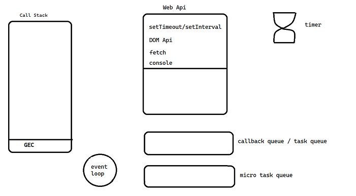
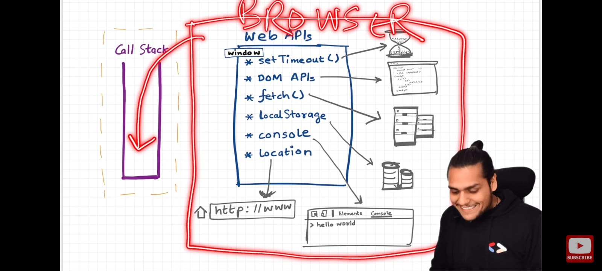
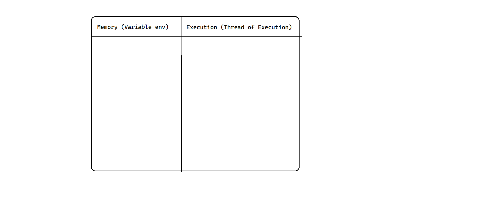
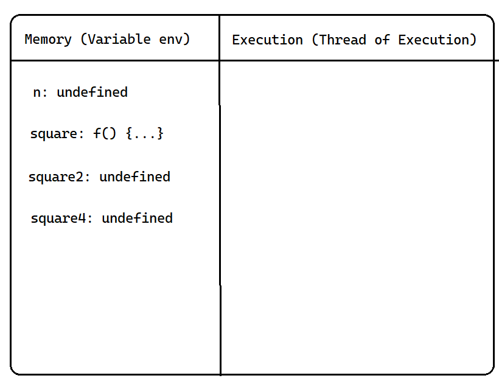
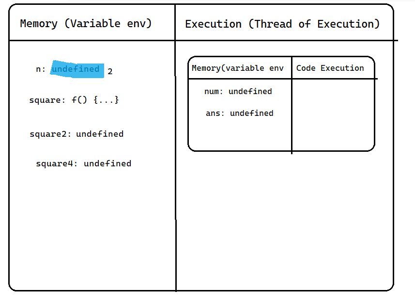
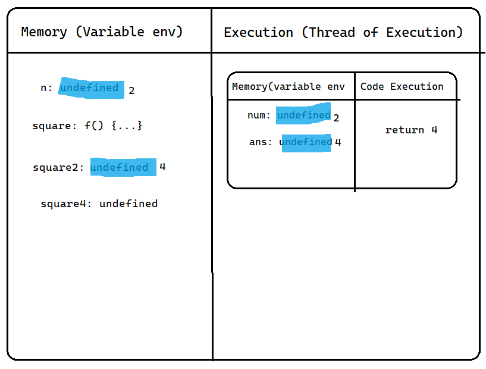
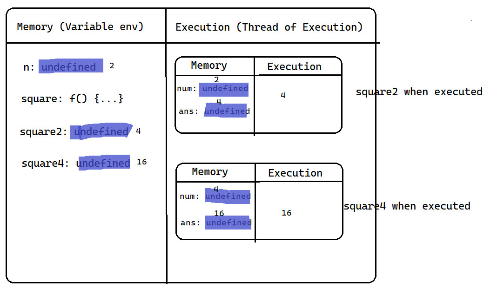

# Event Loop

## `setTimeout` and `setInterval`

```javascript
const cbFn = (person) => {
    console.log("Stop spilling your beauty every where you go, " + person)
}

setTimeout(cbFn, 500, 'Your Grace')
```

**Note:** we pass `cbFn` (the function reference) here, not `cbFn()` (the result of calling it) — `setTimeout` needs a function it can call later, not a value computed right now.

To keep printing every 500ms instead of just once:

```javascript
setInterval(cbFn, 500, 'Your Grace')
```

- The callback (`cbFn`) is registered immediately, but JS doesn't wait around for it — the rest of the script keeps running, and `cbFn` only actually executes once the delay has elapsed. This is the essence of asynchronous behavior in JS.
- `onload`, `DOMContentLoaded`, and React's `componentDidMount` all follow the same pattern: registered up front, but the callback only fires once the corresponding event has actually happened.

**Note:** both `setTimeout` and `setInterval` return a unique timer ID, which can be used to cancel their execution.

```javascript
const timeoutId = setTimeout(() => console.log('Timeout to run'), 1000)
clearTimeout(timeoutId)

const intervalId = setInterval(() => console.log('Jo hoga dekha jaayega'), 400)
clearInterval(intervalId)
```

---

## `setTimeout` Execution Order

### Question 1

```javascript
setTimeout(() => {
  console.log("Ruko zara, hum first");
}, -2);
setTimeout(() => {
  console.log("Aur mein?");
}, 200);
setTimeout(() => {
  console.log("Nhi hum first");
}, 0);
setTimeout(() => {
  console.log("Hum first");
});
```

<details><summary>Show Answer</summary>

```
Ruko zara, hum first
Nhi hum first
Hum first
Aur mein?
```

**Explanation:**
- All four `setTimeout` calls are registered synchronously, up front, before any of their callbacks can run.
- Callbacks with a `0`/negative/omitted delay all effectively become `0`, and run in the order they were *declared* — not in some arbitrary order.
- The callback with a genuinely positive delay (`200`) runs last, once that delay has actually elapsed.

</details>

### General Rules for `setTimeout` Execution Order

- A delay of `0`, a negative delay, or no delay argument at all are all treated identically — as `0`.
- Among callbacks that resolve to the same effective delay, the one **declared first runs first** (FIFO within the same delay).
- Callbacks with a genuinely larger delay always run after ones with a smaller (or zero) delay, regardless of declaration order.

### Question 2

```javascript
setTimeout(() => {
    console.log("Let me check my busy schedule")
}, 200)
setTimeout(() => {
    console.log("Ubuyashiki")
}, 0)
setTimeout(()=>{
    console.log("xxxx pe kab chal rhi?")
})
setTimeout(()=>{
    console.log("ye bata")
}, -400)
```

<details><summary>Show Answer</summary>

```
Ubuyashiki
xxxx pe kab chal rhi?
ye bata
Let me check my busy schedule
```

**Explanation:** Same rule as Question 1 — the `0`, no-delay, and `-400` calls all resolve to an effective delay of `0` and run in declaration order; the `200`ms call runs last.

</details>

---

## Call Stack Formation Example

**Challenge:** trace how functions get pushed and popped on the call stack (starting from the Global Execution Context).




### Question 3

```javascript
setTimeout(() => {
    console.log("Excited for flight!")
}, 200)

const y = () => {
    console.log('y')
}

const x = () => {
    console.log('x')
    y()
}
x()
```

<details><summary>Show Answer</summary>

```
x
y
Excited for flight! (after 200ms)
```

**Call stack trace:**
1. The Global Execution Context (GEC) is pushed onto the call stack when execution starts.
2. `setTimeout` is encountered — its callback is registered with the Web API/timer environment (not run immediately) and execution continues.
3. `x()` is called and pushed onto the call stack.
4. Inside `x()`, `console.log('x')` runs.
5. `y()` is called and pushed onto the call stack, on top of `x()`.
6. Inside `y()`, `console.log('y')` runs.
7. `y()` finishes and is popped off the stack.
8. `x()` finishes and is popped off the stack.
9. The GEC itself is now popped — the call stack is empty, and the synchronous script has finished running.
10. Once the 200ms timer elapses, the event loop moves the registered callback from the callback queue onto the (now-empty) call stack, where it finally executes and logs `"Excited for flight!"`.

</details>

---

## Microtask Queue vs. Macrotask Queue

This is the single most commonly asked event-loop question: **when both a `setTimeout` and a `Promise` are pending, which runs first?**

- **Macrotask queue** (a.k.a. "callback queue" / "task queue"): `setTimeout`, `setInterval`, DOM events, I/O callbacks.
- **Microtask queue**: `Promise.then`/`.catch`/`.finally` callbacks, `async`/`await` continuations, `queueMicrotask()`.

**The rule:** after each single macrotask finishes running, the event loop drains the **entire** microtask queue — including any *new* microtasks that were scheduled while draining it — before it's allowed to move on to the next macrotask. Microtasks always win.

### Question 4 — Basic Microtask vs. Macrotask Ordering

```javascript
console.log("start")
setTimeout(() => { console.log("setTimeout") }, 0)
Promise.resolve().then(() => console.log("promise 1"))
Promise.resolve().then(() => console.log("promise 2"))
console.log("end")
```

<details><summary>Show Answer</summary>

```
start
end
promise 1
promise 2
setTimeout
```

**Explanation:** `console.log("start")` and `console.log("end")` run synchronously first, since none of the async APIs pause the main thread. Both `.then()` callbacks are queued as microtasks and both run before the event loop even considers the `setTimeout` callback — **even though the `setTimeout` delay is `0`** and was registered *before* either promise. Microtasks are always fully drained ahead of the next macrotask, regardless of registration order or timer delay.

</details>

### Question 5 — Chained Microtasks Still Beat the Next Macrotask

```javascript
console.log("start")
setTimeout(() => console.log("timeout"), 0)
Promise.resolve().then(() => {
    console.log("microtask 1")
    Promise.resolve().then(() => console.log("microtask 2 (queued from within microtask 1)"))
})
console.log("end")
```

<details><summary>Show Answer</summary>

```
start
end
microtask 1
microtask 2 (queued from within microtask 1)
timeout
```

**Explanation:** `microtask 2` is scheduled *from inside* `microtask 1`, while the microtask queue is already being drained. Even so, it still runs before `timeout` — the event loop keeps draining the microtask queue until it's completely empty (including anything newly added mid-drain) before it ever looks at the macrotask queue again. This is why a chain of promises, no matter how long, always fully resolves before the next `setTimeout` fires — a real hazard called **microtask starvation**: a runaway chain of self-scheduling microtasks can, in principle, delay macrotasks (rendering, I/O, timers) indefinitely.

</details>

### Question 6 — `async`/`await` in the Ordering

```javascript
console.log('1: sync start')

setTimeout(() => console.log('2: setTimeout'), 0)

async function asyncFn() {
    console.log('3: async fn start')
    await null;
    console.log('4: async fn after await');
}
asyncFn();

Promise.resolve().then(() => console.log('5: promise then'))

console.log('6: sync end')
```

<details><summary>Show Answer</summary>

```
1: sync start
3: async fn start
6: sync end
4: async fn after await
5: promise then
2: setTimeout
```

**Explanation:**
- `asyncFn()` runs **synchronously** up until its first `await` — so `"3: async fn start"` logs immediately, interleaved with the rest of the synchronous code, before `"6: sync end"`.
- The `await null` pauses `asyncFn`, and everything *after* it (`"4: async fn after await"`) is scheduled as a microtask — conceptually the same as a `.then()` callback.
- All synchronous code finishes first (`1`, `3`, `6`), then the microtask queue drains (`4`, then `5`, in the order they were queued), and only then does the macrotask queue get a turn (`2`).

**Interview relevance:** this is why `async`/`await` is often described as "just microtask-based syntax sugar over promises" — the ordering guarantees are identical to plain `.then()` chains, just easier to read.

</details>

---

## Some Additional Examples

### Question 7

```javascript
console.log("start")
setTimeout(() => {
    console.log("Event loop")
}, 500)
console.log("end")
```

<details><summary>Show Answer</summary>

```
start
end
Event loop (after 500ms)
```

**Explanation:** Straightforward application of the same rule — synchronous code always runs to completion before any timer callback fires, regardless of how short the delay is.

</details>

### Question 8 — `fetch` and the Microtask Queue

```javascript
console.log("start")
setTimeout(() => {
    console.log("Event loop")
})
fetch('https://example.com/api/data')
    .then(res => console.log(res))
// ...lots more synchronous code here...
console.log("end")
```

<details><summary>Show Answer</summary>

**Explanation:** `fetch()` returns a `Promise` immediately (the actual network request happens off the main thread) — so this behaves the same as any other promise: `"start"` and `"end"` log synchronously first (along with anything else synchronous in between), the `setTimeout` callback waits in the macrotask queue, and the `fetch().then()` callback only runs once the network response actually arrives, as a microtask — which, once it does arrive, will still run before the queued `setTimeout` callback gets its turn, even if the timer's delay has already elapsed by then.

</details>

### Question 9 — Execution Context Walkthrough

```javascript
var n = 2
function square(num) {
    var ans = num * num;
    return ans
}
var square2 = square(n);
var square4 = square(4);
```

<details><summary>Show Answer</summary>

Walking through this step by step:

1. **Global memory phase:** `n`, `square`, `square2`, and `square4` are all hoisted — `n` and the `var`s initialized to `undefined`, `square` initialized to the full function.
2. **Global execution phase:** `n = 2` is assigned.
3. `square(n)` is called — a new execution context is pushed for `square`, with its own memory phase (`num`, `ans` hoisted) and execution phase (`num = 2`, `ans = 4`, returns `4`). This context is popped once it returns.
4. `square2 = 4` is assigned in the global context.
5. `square(4)` is called the same way, producing a fresh execution context, returning `16`, then popped.
6. `square4 = 16` is assigned.







**Key takeaway:** every function call gets its own fresh execution context, pushed onto the call stack and popped once it returns — `square(n)` and `square(4)` are two entirely separate contexts with their own independent `num`/`ans`, even though they're calls to the same function.

</details>
