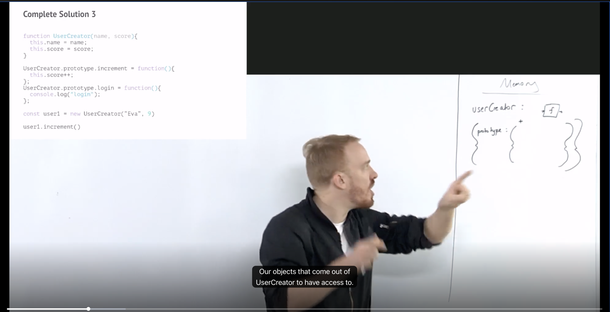
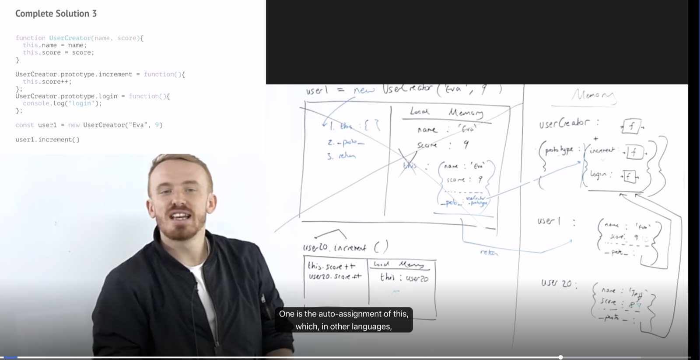
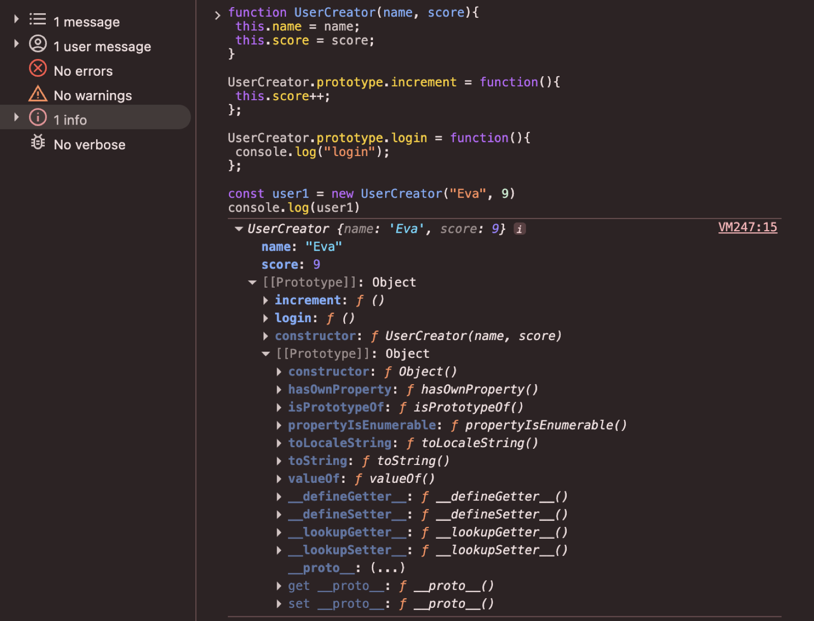
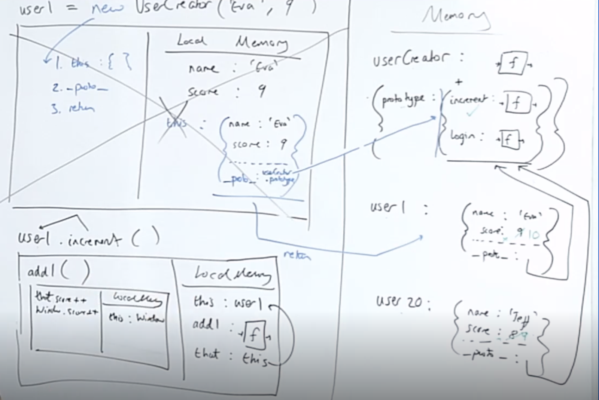
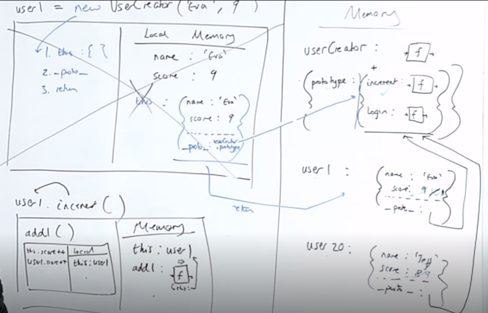
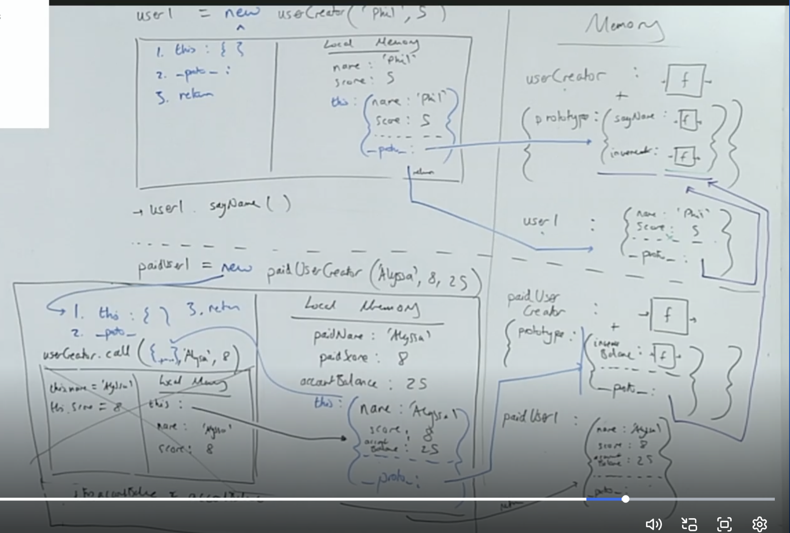

#### Different ways to create Object

##### 1.  using object literal
```
const user = {
    name: 'Rohit',
    score: 5,
    increment() {
        user.score++;
    }
}

user.increment()
console.log(user.score) => 6
```

##### 2. using dot notation
```
const user2 = {};
user2.name = "Ghost",
user2.score = 100,
user2.increment = function() {
    user2.score++
}
```

#### 3. using Object.create
```
const user3 = Object.create(null); // what if null is not there
user3.name = "Alex",
user3.score = 200,
user3.increment = function() {
    user3.score++
}
```
---

Our code is getting repetitive, we're breaking our DRY principle
And suppose we have millions of users!
What could we do?

##### Solution 1. Generate object using a function
```
function userCreator(name, score) {
  const newUser = {};
  newUser.name = name;
  newUser.score = score;
  newUser.increment = function() {
    newUser.score++;
  };
  return newUser;
};
const user1 = userCreator("Rohit", 5);
const user2 = userCreator("Ghost", 100);
const user3 = userCreator("Alex", 200)
user1.increment()
user2.increment()
user3.increment()
console.log(user1.score) => 6
console.log(user2.score) => 101
console.log(user3.score) => 201
```
##### Problems:
Each time we create a new user we make space in our
computer's memory for all our data and functions. 

But
our functions are just copies, we do need the data since it's unique but functions are copies.
suppose we had multiple functions increment, decrement, login, logout, etc. 
Then for each object in GEC, there would be these many methods which would be the same function as that of other objects i.e. copies. 
All these methods should refer to single one.

##### Solution: 
Store the increment function in just one object and have the interpreter look for it.
It it doesn't find the function on user1, look up to that object if it's there

> Note: The only goal we have in Object Oriented Programming is, > can we bundle up the appropriate and relevant functionalities with the relevant data it applies to.
> 
> Not have to go hunt off on another part of our file for a particular function, but just bundle them up together.

##### Make the link with Object.create() technique

```
function userCreator (name, score) {
  const newUser = Object.create(userFunctionStore);
  newUser.name = name;
  newUser.score = score;
  return newUser;
};
const userFunctionStore = {
  increment: function(){
    this.score++;
  },
  login: function(){
    console.log("You're loggedin");
  }
};
const user1 = userCreator("Phil", 4);
const user2 = userCreator("Julia", 5);
user1.increment();
```
If we console the user1 or user2, we would see a new **[[Prototype]]** added to the object in dev-tools. 

So now JS makes use of Prototype chain feature to access the common function

![DevTools: `user1` with own properties and `[[Prototype]]` showing `increment` and `login`](../../Assests/prototype-added-using-object.create.png)

> Here we had to do all the manual linking, create a object, return a object. 
This all problem gets solved using *this* operator

### Solution 3 - Introducing the keyword that automates the hard work: new
const user1 = new userCreator("Phil", 4)
When we call the constructor function with new in front we automate 2 things
1. Create a new user object _this_
2. adds *_proto_* in _this_ object and links it to Function prototype
2. return the new user object _this_

The new keyword automates a lot of our manual work

>  function userCreator(name, score) {
>   ~~const newUser = Object.create(functionStore);~~
>   ~~newUser~~ this.name = name;
>   ~~newUser~~ this.score = score;
>   ~~return newUser;~~
>  }

> let user1 = new userCreator("Phil", 4);


#### Interlude -> Functions are both objects and functions
```
function multiplyBy2(num){
 return num*2
}
multiplyBy2.stored = 5
multiplyBy2(3) // 6
multiplyBy2.stored // 5
multiplyBy2.prototype // {}
```

> when we define a function, then in memory allocation phase the function is assigned a memory and the entire code of the function is put as placeholder. Also this can be thought of an object with **prototype** property which is also an _object_

> We could use the fact that all functions have a default property
> on their object version, ’prototype’, which is itself an object - to
> replace our functionStore object



#### Complete Solution 3
```
function UserCreator(name, score){
 this.name = name;
 this.score = score;
}

UserCreator.prototype.increment = function(){
 this.score++;
};

UserCreator.prototype.login = function(){
 console.log("login");
};

const user1 = new UserCreator("Eva", 9)
user1.increment()
```




---

#### What about this way of definition?

```
function UserCreator(name, score){
  this.name = name;
  this.score = score;

  this.increment = function(){
    this.score++;
  };

  this.login = function(){
    console.log("login");
  };
}

const user1 = new UserCreator("Eva", 9);
user1.increment();
```

###### Prototype Methods vs Own-Copy Methods in JavaScript**: 
  **Prototype Method Version**
  ```
    UserCreator.prototype.increment = function(){ ... }
    UserCreator.prototype.login = function(){ ... }
  ```
  1. name and score are stored directly inside each object.
  2. increment and login are not stored inside each object.
  3. These methods are stored on UserCreator.prototype.
  4. All instances share the same methods.
  5. more memory efficient
  Important point
    - The methods are created only once.
    - Every object accesses them through the prototype chain.

  **Own-Copy Method Version**
  ```
    this.increment = function(){ ... }
    this.login = function(){ ... }
  ```
    1. name and score are stored directly inside each object.
    2. increment and login are also stored directly inside each object.
    3. Every time a new object is created, new copies of these methods are created.
    4. uses more memory
    Important point
    - The methods are recreated for every instance.

const user1 = new UserCreator("Eva", 9);
const user2 = new UserCreator("Sam", 5);

console.log(user1.increment === user2.increment);
> true // In prototype version
> false // In own-copy version

__In the prototype approach, methods are shared; in the own-copy approach, methods are recreated for every object.__

---

#### Calling Prototype methods

> Each function execution context has _this_ in their local context. Follow the rules to find out what it points to. 

##### What if we want to organize our code inside one of our shared functions - perhaps by defining a new inner function

```
function UserCreator(name, score){
 this.name = name;
 this.score = score;
}
UserCreator.prototype.increment = function(){
 function add1(){
 this.score++;
 }
 add1()
};
UserCreator.prototype.login = function(){
 console.log("login");
};
const user1 = new UserCreator(“Eva”, 9)
user1.increment()
```

In real scenario, there can be multiple sub-functions inside method which we re-group or break down into smaller chunks. 

But, now what _this_ points in these break down function inside the method is *interesting*

The _increment_ method in prototype, has _this_ being referred to *user1* since it's called as 
`user1.increment()` and then increment method calls `add1()` so in _add1_ function this refers to *window*. Since there is nothing before `add1()` when function is invoked.



**Problem**: calling functions inside a method, had _this_ pointing to window.

#### Solving this using Arrow Function

Arrow function binds this lexically. _this_ in arrow function points to the scope where it was defined / born / saved

```
function UserCreator(name, score){
 this.name = name;
 this.score = score;
}
UserCreator.prototype.increment = function(){
 const add1 = () => { this.score++ }
 add1()
};
UserCreator.prototype.login = function(){
 console.log("login");
};
const user1 = new UserCreator(“Eva”, 9)
user1.increment()
```


Here, _add1_ is arrow function, so it doesn't have it's own _this_, so it's point to it's lexical scope i.e. _increment_ method or we can say it points to where it was defined i.e. _increment_ function, so **this** in _add1_ is same as _increment_

--- 
> We’re writing our shared methods separately from our object ‘constructor’ itself (off in the User.prototype object)
> ES2015 lets us do so too, using classes

#### The class ‘syntactic sugar’
```
class UserCreator {
 constructor (name, score) {
  this.name = name;
  this.score = score;
 }

 increment () {
  this.score++;
 }

 login () {
  console.log("login");
 }

}
const user1 = new UserCreator("Eva", 9);
user1.increment();
```

This works exactly the same way under the hood as Prototype method that we did earlier.

---

JavaScript uses this proto link to give objects, functions and arrays a bunch of bonus functionality. All objects by
default have **__proto__**
```
const obj = {
 num : 3
}
obj.num // 3
obj.hasOwnProperty("num") // ? Where's this method?
Object.prototype // {hasOwnProperty: FUNCTION}
— With Object.create we override the default __proto__ reference to
Object.prototype and replace with functionStore
— But functionStore is an object so it has a __proto__ reference to
Object.prototype - we just intercede in the chain
```

Arrays and functions are also objects so they get access to all the functions in Object.prototype but also more goodies
```
function multiplyBy2(num){
 return num*2
}
multiplyBy2.toString() //Where is this method?
Function.prototype // {toString : FUNCTION, call : FUNCTION, bind : FUNCTION}
multiplyBy2.hasOwnProperty("score") // Where's this function?
Function.prototype.__proto__ // Object.prototype {hasOwnProperty: FUNCTION}
```

**Note**: __proto__ is now a private variable and not exposed by default on the object; 

---

#### Subclassing

**using prototypal way**

```
function userCreator (name, score){
  this.name = name
  this.score = score
}

userCreator.prototype.sayName = function() {
  console.log("I'm " + this.name);
}

userCreator.prototype.increment = function() {
  this.score++;
}

const user1 = new userCreator("Phil", 5);
const user2 = new userCreator("Tim", 4);

user1.sayName(); // "I'm Phil"

function paidUserCreator (paidName, paidScore, accountBalance) {
  userCreator.call(this, paidName, paidScore);
  // userCreator.apply(this, [paidName, paidScore])
  this.accountBalance = accountBalance;
}

paidUserCreator.prototype = Object.create(userCreator.prototype);

paidUserCreator.prototype.increaseBalance = function () {
  this.accountBalance++;
};

const paidUser1 = new paidUserCreator("Alyssa", 8, 25);
paidUser1.increaseBalance()
paidUser1.sayName() // "I'm Alyssa"
```




**Using Class**
```
class userCreator {
  constructor (name, score) {
    this.name = name;
  }
  this.score = score;
  sayName () {
    console.log("I am " + this.name);
  }
  increment () {
    this.score++;
  }
}

const user1 = new userCreator("Phil", 4);
const user2 = new userCreator("Tim", 4);

user1.sayName()

class paidUserCreator extends userCreator {
  constructor(paidName, paidScore, accountBalance) {
    super (paidName, paidScore)
    this.accountBalance = accountBalance;
  }
  increaseBalance () {
    this.accountBalance++
  }
}

const paidUser1 = new paidUserCreator("Alyssa", 8, 25);
paidUser1.increaseBalance();
paidUser1.sayName();
```